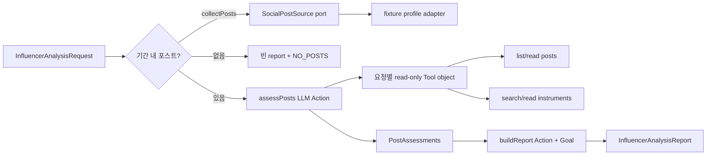

# Fixture 기반 주식 인플루언서 분석 Agent

## Summary

실제 SNS와 LLM provider를 연결하기 전에, 결정적인 classpath fixture와 Embabel 1.5.0 test support만으로 주식 인플루언서 포스트 분석 흐름을 검증한다. 하나의 `influenceranalysis` 수직 슬라이스 안에서 타입 기반 Action 연결, Goal, 매 Action 이후 Planning/Replanning, 구조화 출력, 요청별 읽기 전용 Tool과 provenance 보존을 증명한다.

---

## Problem Frame

현재 프로젝트에는 Embabel starter만 있고 Agent, Tool, 분석 도메인과 아키텍처 검증이 없다. 처음부터 실제 SNS, provider, REST/A2A/A2UI까지 연결하면 수집 실패와 모델 변동성이 Embabel programming model 검증을 가리므로, 재현 가능한 fixture로 핵심 실행 경로를 먼저 고정해야 한다.

---

## Requirements

- R1. `[startInclusive, endExclusive)` 기간과 인플루언서를 입력받아 fixture 포스트를 안정된 순서로 조회하고 post ID 중복을 제거한다.
- R2. 포스트 원문, ID, 작성 시각, 작성자, URL과 출처를 분석 결과까지 보존한다.
- R3. Embabel `@Agent`, `@Action`, `@Condition`, `@AchievesGoal`과 타입 기반 Planning/Replanning으로 수집, LLM 분석, 집계 Action을 연결한다.
- R4. LLM 경계는 Embabel `OperationContext`/`PromptRunner`만 사용하고 Java record 구조화 결과를 생성한다.
- R5. 요청별 분석 workspace에 `list_posts`, `read_post`, `search_instruments`, `read_instrument` 네 개의 bounded read-only `@LlmTool`을 제공한다.
- R6. 종목별 평가는 `POSITIVE`, `NEGATIVE`, `NEUTRAL`, `UNCERTAIN`을 지원하고 확인할 수 없는 ticker를 생성하지 않는다.
- R7. prompt injection 문구를 포함한 SNS 원문은 지시가 아닌 신뢰할 수 없는 데이터로 취급한다.
- R8. 실제 LLM/provider key 없이 Action 단위 및 전체 Agent 실행을 결정적으로 검증한다.
- R9. 오류 Internal Code는 승인된 `PIN-<OWNER>-NNNN` 규칙을 따르며, `PIN-IAN-` namespace를 이 Slice가 소유한다.
- R10. Spring Modulith, ArchUnit, exhaustive Internal Code 검증과 clean build를 Gradle `check`/`build` 완료 조건에 포함한다.

---

## Scope Boundaries

- 실제 SNS API, scraping, 로그인, CAPTCHA 또는 rate-limit 우회는 구현하지 않는다.
- 실제 LLM provider, API key, 모델 품질 평가는 연결하지 않는다.
- REST, A2A, A2UI adapter는 이 기술 spike에서 만들지 않는다. 사용자 대상 기능으로 공개할 때 세 adapter를 동시에 제공한다.
- JPA entity, repository, DB schema와 분석 결과 영속화는 만들지 않는다.
- Embabel의 범용 `FileTools` 및 coding용 `BashTools`는 사용하지 않는다. 분석에 필요한 최소 읽기 권한만 도메인 Tool로 제공한다.
- RAG, MCP, streaming, human-in-the-loop, sub-agent는 첫 Slice에 억지로 넣지 않고 후속 실험으로 분리한다.
- 투자 추천, 매수·매도 판단이나 수익 예측을 생성하지 않는다.

### Deferred to Follow-Up Work

- REST/A2A/A2UI 공통 inbound use case와 기능 동등성 계약: fixture Agent가 안정된 뒤 별도 계획
- 실제 SNS outbound adapter와 pagination/retry/부분 실패 Replanning: 지원 플랫폼과 인증 방식 결정 후
- 실제 종목 기준정보와 RAG/검색: 최초 지원 시장 결정 후
- provider별 모델 평가, golden dataset과 품질 기준: 도메인 결과 계약 안정화 후
- 실행 저장, streaming, 취소/재개와 장기 실행 수명주기: 공개 API 설계 단계

---

## Context & Research

### Relevant Code and Patterns

- `build.gradle.kts`는 Java 25, Spring Boot 4.1.0, Spring Modulith 2.1.0과 `embabel-agent-starter-byok:1.5.0`을 이미 사용한다.
- `src/main/java/com/ypkim/pinbabel/PinbabelApplication.java` 외에는 아직 business Slice가 없으므로 기존 구현을 깨지 않고 첫 Slice 경계를 정할 수 있다.
- `AGENTS.md`는 Embabel-only AI 경계, Vertical Slice/Hexagonal/Modulith 구조와 향후 REST/A2A/A2UI 동등성을 요구한다.

### Institutional Learnings

- 프로젝트에 Modulith/ArchUnit/Internal Code enforcement가 아직 없다. backend compliance 설치 도구의 dry-run은 `config/internal-code/{registry,declarations,occurrences}.json` 부재로 중단되었으므로, U1에서 승인된 규칙과 exhaustive inventory 생성을 먼저 마련해야 한다.
- 사용자가 승인한 Internal Code 규칙은 `PIN-<OWNER>-NNNN`이며 이 Slice의 owner는 `IAN`이다. retired code는 재사용하지 않고 registry에 보존한다.

### External References

- Embabel Agent 1.5.0 tag의 testing reference는 일반 Java Action을 `FakeOperationContext`와 `FakePromptRunner`로 검증하는 방식을 제공한다.
- Embabel 1.5.0은 native `@LlmTool`, `PromptRunner.withToolObject(...)`, 구조화 `creating(...)`, `ScriptedLlmOperations`와 `embabel-agent-test` integration support를 제공한다.
- `embabel-agent-starter-byok:1.5.0`은 provider를 자동 선택하지 않으므로 fixture test는 provider key 없이 실행 가능해야 한다.

---

## Key Technical Decisions

- **하나의 `influenceranalysis` business Slice로 시작:** 수집·정규화·분석 책임이 아직 독립 배포/수명주기를 갖지 않으므로 다섯 Slice로 선분할하지 않는다. 실제 adapter와 사용 사례가 늘어날 때 Named Interface 기준으로 분리한다.
- **fixture adapter도 outbound port 뒤에 배치:** Agent는 fixture 파일을 직접 읽지 않고 `SocialPostSource`와 `InstrumentCatalog`를 사용한다. 후속 실제 SNS/종목 기준정보 adapter가 동일한 port를 구현한다.
- **fixture profile 전용 main adapter:** fixture JSON, 두 outbound adapter와 Agent bean을 실행 가능한 데모 자산으로 `src/main`에 두되 `fixture` profile에서만 활성화한다. production 기본 profile에 테스트 데이터나 충족되지 않은 port 의존성이 등록되지 않게 한다.
- **요청별 Tool object:** 수집된 포스트와 허용 시장 범위는 실행마다 다르므로 singleton `ToolGroup`보다 Action이 만든 `AnalysisWorkspaceTools`를 `withToolObject`로 해당 LLM 호출에만 전달한다. 종목 조회는 workspace가 보유한 bounded `InstrumentCatalog` port를 통해 요청 시장 안에서만 수행한다.
- **범용 네 가지 도구가 아닌 도메인 네 가지 도구:** `read/write/edit/bash`는 coding agent에서 흔한 capability 조합일 뿐 Agent 표준이 아니다. 이 read-only 분석에는 포스트/종목 목록·상세조회만 허용한다.
- **세 Action으로 책임 분리:** `collectPosts`와 `buildReport`는 결정적 Java 로직, `assessPosts`만 LLM Action으로 만든다. 모든 Action은 외부 상태를 변경하지 않으므로 `@Action(readOnly = true)`로 표시하고, 테스트는 LLM 호출 없이 두 결정적 Action을 완전히 검증한다.
- **기간은 반열린 구간:** start와 같은 시각은 포함하고 end와 같은 시각은 제외하여 연속 batch 간 중복을 막는다.
- **빈 기간은 정상 결과:** 해당 기간에 포스트가 없으면 예외 대신 `NO_POSTS` warning과 빈 report를 반환하며 LLM Action을 실행하지 않는 대체 Goal 경로를 둔다. 이는 실제 의미가 있는 첫 Condition/Replanning 사례다.
- **오류와 제한을 결과에 분리:** 분석 불확실성은 `UNCERTAIN`/warning으로 표현하고, 잘못된 기간·fixture 손상처럼 실행 불가능한 경우만 `PIN-IAN-*` 내부 오류를 사용한다.
- **prompt는 Embabel Jinja template:** `classpath:/prompts/` 아래 `.jinja`로 신뢰 경계와 출력 규칙을 버전 관리하고 별도 template framework를 추가하지 않는다.
- **prompt와 Tool의 역할을 분리:** template model에는 분석 범위와 post ID/최소 metadata만 넣고 전체 원문과 canonical instrument 정보는 Tool로 읽게 하여 Tool 사용을 실제 실행 경로에서 검증한다.
- **첫 실행 상한을 코드 계약으로 고정:** 실행당 포스트 100개, 목록 반환 50개, 검색어 100자, 단일 원문 10,000자를 넘으면 잘라서 숨기지 않고 명시적 validation/warning으로 처리한다. 공개 API와 실제 SNS 단계에서 운영 근거를 가지고 재조정한다.

---

## Open Questions

### Resolved During Planning

- 첫 데이터 소스: 실제 SNS 대신 classpath fixture를 사용한다.
- Internal Code 형식: `PIN-<OWNER>-NNNN`, 첫 owner는 `IAN`으로 승인되었다.
- 도구 권한: 첫 Agent에는 네 개의 도메인 read-only Tool만 제공한다.
- API 공개 범위: 이 단계는 내부 기술 spike이며 REST/A2A/A2UI는 후속 공개 단계에서 함께 구현한다.

### Deferred to Implementation

- compliance pack과 기존 Spring Boot 4.1/JUnit 6 test dependency 사이의 실제 resolution은 U1 dependency insight로 확인한다.

---

## Output Structure

    config/internal-code/
      registry.json
      declarations.json
      occurrences.json
    docs/
      internal-codes.md
    gradle/
      backend-compliance.gradle.kts
    src/main/java/com/ypkim/pinbabel/influenceranalysis/
      package-info.java
      application/domain/error/
        InfluencerAnalysisException.java
        InfluencerAnalysisInternalCode.java
      application/domain/model/
        AnalysisPeriod.java
        InfluencerAnalysisRequest.java
        CollectedPost.java
        CollectedPosts.java
        InstrumentReference.java
        Sentiment.java
        PostKind.java
        PostAssessment.java
        PostAssessments.java
        AssessmentEvidence.java
        InstrumentSummary.java
        InfluencerAnalysisReport.java
      application/domain/service/
        InfluencerAnalysisReportService.java
      application/port/out/
        SocialPostSource.java
        InstrumentCatalog.java
      application/service/
        InfluencerAnalysisAgent.java
      application/service/tool/
        AnalysisWorkspaceTools.java
      adapter/out/fixture/
        FixtureSocialPostSource.java
        FixtureInstrumentCatalog.java
    src/main/resources/
      fixtures/influenceranalysis/posts.json
      fixtures/influenceranalysis/instruments.json
      prompts/influenceranalysis/assess-posts.jinja
    src/test/java/com/ypkim/pinbabel/
      architecture/ModularityTest.java
      architecture/ArchitectureTest.java
      influenceranalysis/application/domain/model/InfluencerAnalysisDomainTest.java
      influenceranalysis/application/domain/service/InfluencerAnalysisReportServiceTest.java
      influenceranalysis/adapter/out/fixture/FixtureSocialPostSourceTest.java
      influenceranalysis/adapter/out/fixture/FixtureInstrumentCatalogTest.java
      influenceranalysis/application/service/tool/AnalysisWorkspaceToolsTest.java
      influenceranalysis/application/service/InfluencerAnalysisAgentActionTest.java
      influenceranalysis/application/service/InfluencerAnalysisAgentIntegrationTest.java

`declarations.json`과 `occurrences.json`의 실제 위치가 build-generated inventory로 바뀌는 경우 source control에는 generator와 registry만 두고, compliance task가 생성물 누락·불일치를 검증하도록 조정한다. 수작업으로 비어 있는 inventory를 유지하는 방식은 허용하지 않는다.

---

## High-Level Technical Design

- Planner는 입력/결과 type을 기준으로 다음 Action을 선택하고 각 Action 후 world state를 다시 평가한다.
- 빈 `CollectedPosts`에는 LLM Action을 실행하지 않는 별도 Goal Action을 제공해 비용과 hallucination을 막는다.
- 정상 경로의 최종 report는 각 `PostAssessment`를 원본 `CollectedPost` ID/URL에 연결하고 종목별로 집계한다.
- Tool 출력은 실행 workspace 안의 데이터만 반환하며 결과 개수와 문자열 길이에 상한을 둔다.

---

## Implementation Units

### U1. 검증 및 Internal Code 기반

**Goal:** 코드 작성 전에 프로젝트 전체 완료 기준을 Gradle에 연결하고 Embabel test support를 준비한다.

**Requirements:** R8, R9, R10

**Dependencies:** 승인 완료된 `PIN-<OWNER>-NNNN` 규칙

**Files:**
- Modify: `build.gradle.kts`
- Create: `gradle/backend-compliance.gradle.kts`
- Create: `config/internal-code/registry.json`
- Create or generate: `config/internal-code/declarations.json`
- Create or generate: `config/internal-code/occurrences.json`
- Create: `docs/internal-codes.md`
- Create: `src/test/java/com/ypkim/pinbabel/architecture/ModularityTest.java`
- Create: `src/test/java/com/ypkim/pinbabel/architecture/ArchitectureTest.java`

**Approach:**
- `testImplementation("com.embabel.agent:embabel-agent-test:${property("embabelVersion")}")`를 추가하되 starter와 동일한 1.5.0 property를 사용한다.
- Spring Modulith `ApplicationModules.of(PinbabelApplication.class).verify()`와 ArchUnit 규칙을 `check`에 포함한다.
- `PIN-IAN-0001`부터 의미 단위로 registry에 할당하고 owner namespace, active/retired 상태, 설명을 기록한다.
- source scan으로 선언과 실제 semantic occurrence를 완전하게 생성/검증하여 duplicate, unregistered, unused, multiple-assignment를 모두 실패시킨다. 단순 빈 JSON fixture를 compliance 통과 수단으로 사용하지 않는다.
- Liquibase author 검증은 현재 migration이 없어도 future migration guard로 연결하고 author를 `ypkim`으로 고정한다.

**Execution note:** compliance task부터 실패하는 test를 확인한 뒤 최소 설정으로 green으로 만든다.

**Test scenarios:**
- Integration: application context가 provider key 없이 로드되고 Embabel test support class가 resolution된다.
- Architecture: Modulith verification이 순환/불법 module dependency를 탐지한다.
- Error path: 중복, 미등록, unused, retired 재사용 Internal Code 각각이 검증 task를 실패시킨다.
- Build: compliance task가 `check`와 최종 `build` task graph에 실제로 연결된다.

**Verification:**
- `dependencyInsight`로 Embabel 1.5.0과 Spring Boot 4.1/JUnit/ArchUnit resolution을 기록한다.
- 관련 compliance test와 `./gradlew check`가 통과한다.

### U2. 분석 Domain과 fixture outbound adapter

**Goal:** 외부 네트워크 없이도 실제 SNS adapter와 같은 port 계약으로 분석 입력을 결정적으로 준비한다.

**Requirements:** R1, R2, R6, R9

**Dependencies:** U1

**Files:**
- Create: `src/main/java/com/ypkim/pinbabel/influenceranalysis/package-info.java`
- Create: `src/main/java/com/ypkim/pinbabel/influenceranalysis/application/domain/model/*.java`
- Create: `src/main/java/com/ypkim/pinbabel/influenceranalysis/application/port/out/SocialPostSource.java`
- Create: `src/main/java/com/ypkim/pinbabel/influenceranalysis/application/port/out/InstrumentCatalog.java`
- Create: `src/main/java/com/ypkim/pinbabel/influenceranalysis/adapter/out/fixture/*.java`
- Create: `src/main/java/com/ypkim/pinbabel/influenceranalysis/application/domain/error/*.java`
- Create: `src/main/resources/fixtures/influenceranalysis/posts.json`
- Create: `src/main/resources/fixtures/influenceranalysis/instruments.json`
- Test: `src/test/java/com/ypkim/pinbabel/influenceranalysis/application/domain/model/InfluencerAnalysisDomainTest.java`
- Test: `src/test/java/com/ypkim/pinbabel/influenceranalysis/adapter/out/fixture/FixtureSocialPostSourceTest.java`
- Test: `src/test/java/com/ypkim/pinbabel/influenceranalysis/adapter/out/fixture/FixtureInstrumentCatalogTest.java`

**Approach:**
- immutable Java records와 enum으로 request, period, post, assessment와 report 계약을 만든다.
- `SocialPostSource.findPosts(...)`는 provenance가 포함된 `CollectedPosts`를 반환하며 adapter가 시간 필터, ID dedup과 `(publishedAt, postId)` 안정 정렬을 수행한다.
- `InstrumentCatalog`는 검색 가능한 immutable 종목 기준정보를 제공하고 `FixtureInstrumentCatalog`가 별도 JSON을 읽어 실제 기준정보 adapter의 교체 경계를 보존한다.
- fixture adapter와 이를 소비하는 Agent bean은 `fixture` profile에서만 활성화하고 Jackson mapping 객체가 Domain 밖으로 새지 않게 한다.
- fixture에는 NVDA 긍정, TSLA 부정, MSFT 중립, 혼합 종목, 모호한 회사명, 중복 ID, 범위 밖/경계 포스트와 prompt injection 문구를 포함한다.

**Test scenarios:**
- Happy path: start와 같은 포스트는 포함되고 end와 같은 포스트는 제외된다.
- Edge case: 중복 post ID는 한 번만 반환되고 결과 순서가 반복 실행마다 동일하다.
- Edge case: 한 포스트의 여러 종목과 서로 다른 sentiment를 표현할 수 있다.
- Error path: end가 start보다 이르거나 같은 요청은 `PIN-IAN-*` validation 오류가 된다.
- Error path: fixture가 없거나 malformed이면 내부 원인을 보존한 `PIN-IAN-*` source 오류가 된다.
- Security: prompt injection 문자열은 변형·실행되지 않고 원문 데이터로 보존된다.

**Verification:**
- Domain/adapter test만으로 fixture 조회 계약과 provenance가 재현된다.
- Domain/application package가 fixture/Jackson/Spring type을 참조하지 않는다.

### U3. 요청 범위 읽기 전용 분석 Tool

**Goal:** LLM이 전체 파일시스템이나 shell 없이 현재 분석에 필요한 원문과 종목 기준정보만 탐색하게 한다.

**Requirements:** R5, R6, R7

**Dependencies:** U2

**Files:**
- Create: `src/main/java/com/ypkim/pinbabel/influenceranalysis/application/service/tool/AnalysisWorkspaceTools.java`
- Test: `src/test/java/com/ypkim/pinbabel/influenceranalysis/application/service/tool/AnalysisWorkspaceToolsTest.java`

**Approach:**
- Embabel native `@LlmTool`로 `list_posts`, `read_post`, `search_instruments`, `read_instrument`를 선언한다.
- Tool object constructor에 해당 실행의 `CollectedPosts`, 요청의 시장 범위와 read-only `InstrumentCatalog` port만 전달한다. 전체 catalog를 LLM context나 메모리 snapshot으로 복사하지 않는다.
- 목록/search는 위에서 정한 포스트 100개, 목록 50개, query 100자, 원문 10,000자 상한을 적용한다. 상세 조회는 exact ID만 받고 not-found를 명시적인 결과로 반환한다.
- Tool에는 write/edit/bash, 임의 path/URL, reflective object 접근을 노출하지 않는다.

**Test scenarios:**
- Happy path: 목록에서 얻은 ID로 상세 원문과 provenance를 조회한다.
- Happy path: ticker 또는 회사명으로 검색한 뒤 canonical instrument를 exact ID로 조회한다.
- Edge case: 대소문자/공백이 다른 query도 결정적으로 정규화된다.
- Negative: 없는 post/instrument ID와 빈/과대 query는 bounded 오류 결과를 반환한다.
- Security: Tool 반환량이 상한을 넘지 않고 현재 실행 밖의 post를 조회할 수 없다.
- Architecture: 모든 exposed method가 read-only이며 mutation method가 없다.

**Verification:**
- Embabel tool factory가 네 method를 발견하고 기대한 name/schema를 생성한다.
- 동일 Tool 호출은 동일 입력에 같은 결과를 반환한다.

### U4. Embabel Agent, Action, Goal과 prompt template

**Goal:** fixture 데이터를 Embabel이 계획하여 구조화 평가와 provenance report로 변환하게 한다.

**Requirements:** R2, R3, R4, R6, R7, R9

**Dependencies:** U2, U3

**Files:**
- Create: `src/main/java/com/ypkim/pinbabel/influenceranalysis/application/service/InfluencerAnalysisAgent.java`
- Create: `src/main/resources/prompts/influenceranalysis/assess-posts.jinja`
- Test: `src/test/java/com/ypkim/pinbabel/influenceranalysis/application/service/InfluencerAnalysisAgentActionTest.java`

**Approach:**
- `collectPosts(request)` Action이 `SocialPostSource`를 호출해 `CollectedPosts`를 world state에 추가한다. `assessPosts`는 수집 결과, 요청 시장 범위와 `InstrumentCatalog` port로 bounded Tool object를 구성한다. fixture 읽기는 외부 상태를 변경하지 않으므로 이 Action을 포함한 모든 Action에 `readOnly = true`를 명시한다.
- `@Condition(name = "hasPosts")`와 `@Condition(name = "noPosts")`가 `CollectedPosts`를 평가한다. `assessPosts`와 정상 Goal에는 `hasPosts`, 빈 결과 Goal에는 `noPosts` precondition을 부여해 두 경로를 동시에 실행할 수 없게 한다.
- 비어 있지 않을 때만 `assessPosts(request, posts, OperationContext)`가 실행된다. 공식 1.5.0 호출 순서인 `context.ai().withDefaultLlm().withToolObject(workspace).rendering("influenceranalysis/assess-posts").createObject(PostAssessments.class, model)`로 구조화 출력을 받는다.
- prompt에는 SNS 원문을 명령으로 따르지 말 것, ticker를 추측하지 말 것, 모든 판단에 post ID와 근거를 연결할 것, `UNCERTAIN` fallback을 사용할 것을 명시한다.
- `buildReport(...)`는 결정적 집계 Action이자 `@AchievesGoal`이며, 빈 posts에는 별도 `@AchievesGoal` Action이 `NO_POSTS` report를 만든다.
- report는 투자 자문이 아니라는 disclaimer와 누락/불확실성 warning을 항상 포함한다.

**Test scenarios:**
- Happy path: 수집 결과가 있으면 assess Action이 한 번 호출되고 structured assessments가 종목별 report로 집계된다.
- Edge case: 긍정·부정이 충돌하면 양쪽 provenance를 보존하고 단정적 결론 대신 conflict/warning을 표시한다.
- Edge case: 모호한 ticker는 `UNCERTAIN`이며 canonical ticker가 비어 있다.
- Empty: 포스트가 없으면 LLM 호출 없이 빈 Goal 결과가 생성된다.
- Security: generated prompt가 원문 신뢰 경계와 prompt-injection 방어 규칙을 포함한다.
- Error path: assessment가 존재하지 않는 post ID를 참조하면 `PIN-IAN-*` 일관성 오류로 report 생성을 중단한다.

**Verification:**
- `FakeOperationContext`/`FakePromptRunner`로 prompt, tools, structured output type과 호출 횟수를 검증한다.
- Action 메서드 단위 테스트에는 실제 provider나 Spring AI 직접 호출이 없다.

### U5. 전체 Agent 실행과 planning trace 검증

**Goal:** 실제 모델 없이도 Embabel planner가 fixture 요청에서 Goal까지 도달하며 의미 있는 분기를 재계획하는지 증명한다.

**Requirements:** R3, R8, R10

**Dependencies:** U1, U4

**Files:**
- Create: `src/test/java/com/ypkim/pinbabel/influenceranalysis/application/service/InfluencerAnalysisAgentIntegrationTest.java`
- Modify: `src/test/java/com/ypkim/pinbabel/PinbabelApplicationTests.java`

**Approach:**
- `EmbabelMockitoIntegrationTest`로 Spring context의 Agent 등록, 기본 model mock과 정상 Goal 도달을 검증한다.
- 별도 tool-loop integration test는 1.5.0 API artifact의 `ScriptedLlmOperations.callTool(...).returnObject(...)`와 `IntegrationTestUtils`를 사용한다. Mockito의 최하위 `createObject` stub만으로 Tool 실행까지 검증했다고 간주하지 않는다.
- 정상 script는 포스트/종목 Tool을 호출한 뒤 구조화 `PostAssessments`를 반환하고, fixture request로 Agent를 호출해 최종 `InfluencerAnalysisReport`를 검증한다.
- 1.5.0의 `EventSavingAgenticEventListener`를 `ProcessOptions.withListener(...)`에 전달해 `AgentProcessPlanFormulatedEvent`, `ActionExecutionStartEvent`, `ActionExecutionResultEvent`, Tool request/response와 `GoalAchievedEvent`를 캡처하되 운영 observability backend는 추가하지 않는다.
- 빈 기간 실행은 수집 후 world state 재평가로 LLM Action을 건너뛰고 empty Goal을 선택했는지 검증한다.

**Test scenarios:**
- Integration: Agent가 Spring context에 등록되고 정상 fixture가 `collect -> assess -> build report`로 Goal에 도달한다.
- Replanning: 빈 fixture 범위는 `collect -> empty report`로 재계획하며 LLM/tool 호출 수가 0이다.
- Condition: 같은 world state에서 `hasPosts`와 `noPosts`가 동시에 참이 되지 않고 planner가 반대 경로의 Action을 선택하지 않는다.
- Tool use: scripted LLM이 네 Tool 중 필요한 Tool을 호출하고 반환값으로 structured response를 완성한다.
- Provenance: 최종 종목 요약의 모든 evidence post ID/URL이 수집 fixture에 존재한다.
- Determinism: 같은 script와 fixture를 반복 실행해 동일한 domain report와 action sequence를 얻는다.
- Boot: 기본 profile과 fixture test profile 모두 provider credential 없이 context가 로드된다.

**Verification:**
- 좁은 unit/integration/architecture test, `./gradlew check`, 마지막으로 `./gradlew clean build --rerun-tasks --no-build-cache`를 실행한다.
- test report에 실제 live LLM/network 호출이 없음을 확인한다.

---

## Change-Signal Routing

| Signal | Status | 적용 내용 |
|---|---|---|
| Java backend code | Required | Java 25, record/enum, 작은 메서드, null/collection 계약, negative test |
| Domain/Application model | Required | framework-free Domain, adapter DTO 격리, provenance invariant |
| Slice/module boundary | Required | 하나의 business Slice, Modulith verify, ArchUnit inward dependency |
| Dependency/build | Required | Embabel test artifact resolution, compliance task graph, clean build |
| Exception/error path | Required | `PIN-IAN-*` registry, propagation, 원인 보존, negative test |
| Internal Code/catalog | Required | owner namespace, retired 보존, exhaustive generated inventory 검증 |
| Untrusted content/security | Required | prompt injection trust boundary, bounded Tool input/output, no shell/write/network |
| HTTP/API contract | N/A | 이번 단계는 외부 사용자 API를 만들지 않음 |
| Authentication/authorization | N/A | inbound API와 사용자 identity가 없음 |
| Persistence/DB/schema | N/A | fixture는 read-only classpath resource이며 상태 저장 없음 |
| External API/HTTP client | N/A | 실제 SNS와 종목 provider 연결 없음 |
| Async/event/saga/transaction | N/A | 영속 상태 변경과 분산 workflow가 없음 |
| Public collection search/paging | N/A | Tool 내부 bounded lookup일 뿐 공개 collection API가 아님 |
| Streaming/accepted operation | N/A | 동기 test invocation만 검증 |

---

## Verification Matrix

| Verification category | Status | Evidence/command |
|---|---|---|
| Unit and negative tests | Required | Domain, fixture adapter, Tool, Action tests |
| Spring Modulith | Required | `ApplicationModules.verify()` linked to `check` |
| ArchUnit | Required | Slice/framework dependency and Tool exposure rules |
| Internal Code | Required | registry + generated declarations/occurrences exhaustive validation |
| Dependency resolution | Required | `dependencyInsight` for Embabel/Spring/JUnit/ArchUnit |
| Security | Required | injection fixture, bounded Tool tests, absence of mutation/network capability |
| Integration | Required | scripted AgentInvocation to Goal, action/replanning trace |
| Full build | Required | `./gradlew clean build --rerun-tasks --no-build-cache` |
| Vulnerability scan | Gap to resolve | 저장소에 기존 scan task가 없으므로 U1에서 표준 Gradle scan 도입 여부와 CI 비용을 확인; 미도입 시 완료 보고에 gap 명시 |
| API contract/auth | N/A | 외부 API 없음 |
| Persistence/Liquibase migration | N/A | schema 변경 없음; future author guard만 설치 |
| External service contract | N/A | fixture 외부 호출 없음 |

---

## System-Wide Impact

- **Interaction graph:** Spring이 fixture profile에서 adapter와 Agent를 등록하고, Embabel planner가 typed world-state로 Action을 선택한다. 기존 application entry point와 웹/JPA 기능에는 새 호출 경로가 없다.
- **Error propagation:** validation/source corruption/assessment consistency 오류만 `PIN-IAN-*` exception으로 올라가며, 분석 불확실성과 no-data는 report warning으로 종료한다.
- **State lifecycle risks:** 모든 workspace와 결과는 invocation-local immutable object다. fixture dedup은 source adapter에서 한 번 수행하고 mutable singleton cache를 두지 않는다.
- **API surface parity:** 이번 단계에는 외부 surface가 없다. 후속 REST/A2A/A2UI가 동일 application invocation port를 호출해야 하며 이 Agent 로직을 복제하지 않는다.
- **Integration coverage:** unit test만으로 증명할 수 없는 Agent 등록, planner Action 순서, replan 분기, Goal 도달과 tool wiring을 U5가 검증한다.
- **Unchanged invariants:** 실제 SNS, DB, 공개 API, provider 설정은 변경하지 않으며 기본 application은 provider key 없이 계속 시작 가능해야 한다.

---

## Risks & Dependencies

| Risk | Mitigation |
|---|---|
| Embabel 문서와 1.5.0 Java API signature 차이 | Hub의 최신 예보다 `v1.5.0` tag source/test와 resolved jar를 우선하고 dependency를 고정한다. |
| fixture가 LLM 품질을 과대평가 | 이 단계의 합격 기준을 orchestration/contract 재현성으로 한정하고 모델 품질은 golden dataset 단계로 분리한다. |
| Tool이 필요 이상으로 넓은 권한을 획득 | invocation-local immutable 자료와 네 read-only method만 전달하고 path/URL/shell/write를 노출하지 않는다. |
| prompt injection이 분석 지시를 오염 | trust-boundary template, 악성 fixture, structured output/provenance validation을 함께 검증한다. |
| compliance inventory가 수동 빈 파일로 형식화 | source 기반 exhaustive generation과 stale/unused 검증을 `check`에 연결한다. |
| 빈 기간 분기가 artificial replanning이 됨 | 실제 비용 절감과 no-data semantics가 있는 분기로만 사용하고 인위적 failure를 만들지 않는다. |
| `fixture` bean이 production에 등록 | profile 조건과 기본-profile context test로 차단한다. |

---

## Success Metrics

- 정상 fixture와 빈 기간 fixture 모두 live provider/network 없이 Embabel Goal에 도달한다.
- 정상 경로의 모든 종목 판단이 존재하는 post ID와 URL로 역추적된다.
- prompt injection, 모호한 ticker, 중복, 기간 경계와 빈 결과 negative test가 모두 통과한다.
- Agent에 노출된 Tool schema가 정확히 네 개의 read-only capability로 제한된다.
- Modulith, ArchUnit, Internal Code와 전체 clean build가 하나의 Gradle 검증 경로에서 통과한다.

---

## Documentation / Operational Notes

- fixture는 가상 데이터임을 resource와 test 이름에 명시하고 실제 인플루언서의 투자 견해로 오인될 이름/URL을 사용하지 않는다.
- README 후속 갱신 시 `fixture` profile 실행법, live provider가 필요 없다는 점과 투자 자문이 아니라는 제한을 기록한다.
- 첫 Internal Code allocation과 namespace 표는 `docs/internal-codes.md`에 기록한다.
- 운영 배포나 secret 변경은 없으며 rollback은 새 Slice/config/build wiring 제거로 한정된다.

---

## Sources & References

- Project constraints: `AGENTS.md`
- Build configuration: `build.gradle.kts`
- [Embabel Agent official repository](https://github.com/embabel/embabel-agent)
- [Embabel Agent v1.5.0 source](https://github.com/embabel/embabel-agent/tree/v1.5.0)
- [Embabel Hub reference](https://hub.embabel.com/)
- [Embabel template reference](https://hub.embabel.com/reference/templates)
- [Embabel Java agent template](https://github.com/embabel/java-agent-template)
