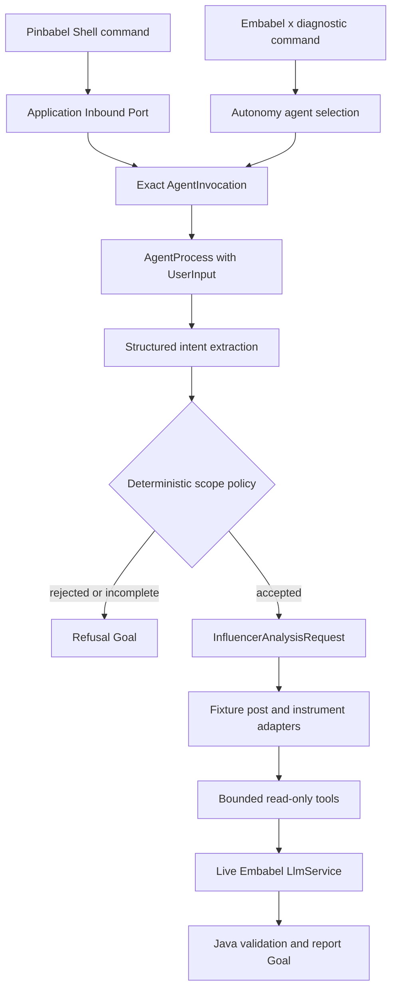
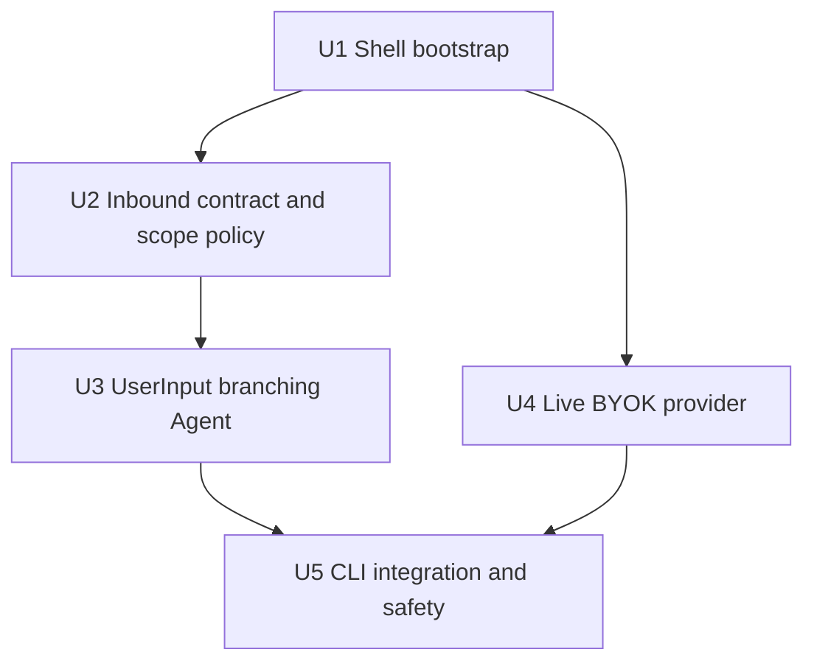

# Embabel CLI와 실 LLM 기반 인플루언서 분석

## Summary

현재 fixture 분석 Agent를 Embabel 1.5.0 공식 Shell에서 자연어로 실행할 수 있게 만들고, 분석 도메인 밖의 요청은 도구 실행 전에 명시적으로 거절한다. BYOK starter의 무키 실행 특성을 유지하면서 별도 live profile에서만 실제 LLM을 연결하여, CLI에서 fixture 수집부터 실 모델 분석과 provenance 보고서까지 직접 검증할 수 있게 한다.

---

## Problem Frame

현재 Agent는 `InfluencerAnalysisRequest`를 직접 입력받으므로 Embabel Shell의 `execute`/`x` 명령이 전달하는 `UserInput`에서 시작할 수 없다. 또한 BYOK starter는 API key 없이 애플리케이션을 시작하게 해 주지만 기본 LLM은 `setup-required` placeholder이므로 실제 분석 호출은 실패한다. 공식 Shell의 기본 `chat`은 범용 chatbot을 생성할 수 있어 “주식 인플루언서 포스트 분석만 수행한다”는 Pinbabel의 경계와도 맞지 않는다.

---

## Requirements

- R1. Embabel 1.5.0 공식 Shell starter를 사용해 `agents`, `actions`, `goals`, `models`, `profiles`, `execute`/`x` 등 개발용 명령을 실행할 수 있어야 한다.
- R2. 자연어 입력을 프로젝트 소유의 구조화된 분석 의도 또는 거절 결과로 변환하고, Embabel `UserInput`이나 Shell 타입을 Domain Model에 노출하지 않아야 한다.
- R3. 허용 범위는 “지정된 주식 인플루언서가 특정 기간에 게시한 SNS 포스트의 종목별 평가를 분석”하는 요청으로 제한한다.
- R4. 일반 대화, 코딩, 날씨, 레시피, 범용 금융 질의, 투자 자문, 매수·매도 추천, 가격·수익 예측과 prompt injection 요청은 수집/종목/분석 Tool 실행 전에 거절해야 한다.
- R5. 거절 여부를 LLM prompt만으로 결정하지 않고, 구조화된 분류·추출 결과에 결정적인 Java 정책과 필수 필드 검증을 적용해야 한다.
- R6. 허용된 입력은 플랫폼, 인플루언서 식별자, `[startInclusive, endExclusive)` 기간, timezone과 선택 시장 범위를 `InfluencerAnalysisRequest`로 매핑한 뒤 기존 Agent 흐름으로 연결해야 한다.
- R7. 기존 `fixture` profile과 테스트는 API key 없이 계속 실행되어야 한다.
- R8. 실 LLM은 Embabel BYOK API와 `LlmService`를 통해서만 연결하고 Application code에서 Spring AI provider API를 직접 사용하지 않아야 한다.
- R9. OpenAI-compatible 접속 정보는 `OPENAI_API_KEY`와 `OPENAI_BASE_URL` 환경 변수에서만 읽고 source, YAML 기본값, fixture, 테스트 출력, 예외와 로그에 남기지 않아야 한다.
- R10. live profile을 선택했는데 key가 없거나 검증되지 않으면, 분석 실행 전에 안전하고 이해 가능한 설정 오류로 실패해야 한다.
- R11. 정상·거절·필수 입력 누락·prompt injection 경로를 Embabel test support로 결정적으로 검증하고, 거절 경로에서는 도메인 Tool과 보고서 분석 LLM 호출이 없음을 증명해야 한다.
- R12. Pinbabel 전용 CLI 명령은 이번 단계의 개발용 inbound adapter이며, 후속 REST/A2A/A2UI가 재사용할 Application Inbound Port와 framework-neutral command/result 경계를 마련해야 한다. Embabel 기본 `x`는 Agent/Planning 진단 명령으로 유지하되 공개 use-case 계약으로 간주하지 않는다.

---

## Scope Boundaries

- 실제 SNS API와 scraping은 연결하지 않고 기존 classpath fixture를 계속 사용한다.
- REST, A2A, A2UI adapter는 이번 단계에서 구현하지 않는다. 공통 Inbound Port를 먼저 만들고 세 공개 adapter는 다음 계획에서 함께 구현한다.
- 분석 결과 영속화, DB schema와 H2 테이블은 추가하지 않는다. 이번 흐름은 읽기 전용이며 현재 단계에 DB가 필요하지 않다.
- 범용 coding agent용 `read`, `write`, `edit`, `bash` Tool은 추가하지 않는다.
- Shell의 open mode(`x -o`)는 지원 경로로 간주하지 않는다. Pinbabel은 등록된 Agent 경계 안에서 실행되는 closed mode만 사용한다.
- 투자 판단이나 실시간 시세 질의 기능으로 범위를 넓히지 않는다.

### Deferred to Follow-Up Work

- REST/A2A/A2UI 기능 동등성, 인증·인가, streaming, 취소/재개와 공개 계약
- 실제 SNS outbound adapter, pagination, rate limit, retry와 부분 실패 Replanning
- provider/model별 golden dataset, 비용·품질 비교와 운영 기본 모델 선택
- 분석 실행 및 결과 영속화와 장기 실행 상태 관리

---

## Context & Research

### Relevant Code and Patterns

- `build.gradle.kts`는 `embabel-agent-starter-byok:1.5.0`과 `embabel-agent-test:1.5.0`을 동일한 version property로 관리한다.
- `InfluencerAnalysisAgent`는 `fixture` profile에서만 등록되며 현재 첫 Action 입력이 `InfluencerAnalysisRequest`다.
- `InfluencerAnalysisAgent.assessPosts(...)`는 `OperationContext.ai().withDefaultLlm()`으로 모델을 선택하므로 live profile이 Embabel model provider의 실제 default LLM을 제공해야 한다.
- `InfluencerAnalysisAgentIntegrationTest`는 `AgentInvocation`, `ScriptedLlmOperations`, 실제 condition parser와 event listener를 사용해 Planning/Replanning과 Tool 호출을 검증하는 기존 패턴이다.
- 현재 패키지는 `application.domain`, `application.port.out`, `application.service`, `adapter.out` 경계를 사용한다. 새 계약은 `application.port.in`, CLI는 `adapter.in.cli`, provider 설정은 `adapter.out.llm`에 둔다.

### Institutional Learnings

- LLM 구조화 출력은 신뢰할 수 있는 도메인 결과가 아니다. 현재 실행의 post ID, canonical instrument, 허용 시장과 provenance를 결정적인 Java 로직으로 재검증해야 한다.
- Embabel Condition을 후속 Action의 `pre`에서 사용하려면 그 조건을 평가할 수 있게 만드는 선행 Action의 `post`에도 조건을 선언해야 한다. 범위 허용/거절 분기에도 같은 GOAP 연결 규칙을 적용한다.
- 구조화 Tool 결과는 Embabel 1.5.0에서 `Tool.Result.WithArtifact`일 수 있으므로 새 테스트가 단순 text wrapper를 가정하지 않게 한다.

### External References

- Embabel 1.5.0 Shell starter는 `execute`/`x`, Agent/Action/Goal 조회, 실행 이력, blackboard, model 조회와 Spring Shell 기반 interactive mode를 제공한다.
- Shell의 closed mode는 `Autonomy.chooseAndRunAgent(...)`로 Agent를 선택하고, open mode는 platform 전체 Action과 자동 Goal 승인을 사용한다. 이 프로젝트는 closed mode만 지원한다.
- 기본 `chat`은 별도 `Chatbot` bean이 없으면 범용 `DefaultChatAgentBuilder`를 생성하므로 Pinbabel 전용 범위가 보장되지 않는다.
- BYOK starter는 key 없이 시작할 수 있도록 `setup-required` placeholder LLM을 제공한다. 실 호출에는 공식 provider factory의 `buildValidated()`로 만든 `LlmService`가 필요하다.
- 공식 OpenAI-compatible factory는 custom base URL을 받는 `byok(baseUrl, apiKey, validationModel, validationProvider)`를 제공한다. 현재 프로젝트는 `OPENAI_API_KEY`와 `OPENAI_BASE_URL`을 운영 입력으로 사용하고 모델명은 secret이 아닌 application 설정에서 명시적으로 고정한다.

---

## Key Technical Decisions

- **공식 Shell을 개발 콘솔로 사용:** `embabel-agent-starter-shell:1.5.0`을 추가해 Embabel의 Planning, blackboard, 실행 이력과 모델 상태를 그대로 관찰한다.
- **제품 지원 명령은 `pinbabel`, 진단 명령은 closed-mode `x`:** 사용자의 기본 실행 예제는 공통 Inbound Port를 호출하는 `pinbabel "..."`로 제공한다. Embabel Planning을 직접 관찰할 때만 closed-mode `x`를 사용하며 open mode는 문서와 테스트에서 금지한다.
- **두 단계 범위 방어:** Shell의 Agent 선택 confidence는 1차 필터로만 사용한다. 선택된 Agent 내부에서 구조화된 의도 추출 후 Java `AnalysisScopePolicy`가 허용 작업, 필수 필드, 기간과 금지 의도를 다시 판정한다.
- **거절도 명시적인 Goal 결과:** 범위 밖 요청이나 필수 입력이 부족한 요청은 예외 또는 임의 대화 응답이 아니라 project-owned refusal 결과에 도달한다. 이 경로에서는 post/instrument Tool과 본 분석 Action을 호출하지 않는다.
- **Framework 타입 격리:** Embabel `UserInput`은 `application.service`의 Agent 경계에서 즉시 project-owned command/decision으로 변환한다. `application.domain.model`과 `application.port.in`은 Spring Shell 및 provider SDK 타입에 의존하지 않는다.
- **공통 Inbound Port를 먼저 마련:** Pinbabel 전용 CLI adapter는 자연어 command를 Inbound Port로 전달하고, 그 구현은 특정 Agent를 `AgentInvocation`으로 실행한다. 이후 REST/A2A/A2UI도 같은 use case를 호출하고 각 protocol DTO만 독립적으로 mapping한다. Embabel 기본 `x`는 `Autonomy`로 같은 Agent를 직접 실행하는 개발 진단 경로이므로 port parity 대상에서는 제외하지만 Agent 내부 안전 정책은 우회할 수 없다.
- **BYOK 유지:** provider starter로 교체해 key 없는 startup을 깨지 않고, `live-openai` profile에서만 `OPENAI_API_KEY`와 `OPENAI_BASE_URL`로 validated `LlmService`를 등록한다. base URL은 사용자 요청으로 바꿀 수 없고 배포 환경의 operator-owned 설정으로만 주입한다.
- **범용 chat을 project-owned Chatbot으로 대체:** Embabel 1.5.0에는 `chat`만 비활성화하는 공식 설정이 확인되지 않았으므로, Pinbabel 범위 정책과 같은 Inbound Port를 사용하는 domain-scoped `Chatbot` bean을 등록한다. 기본 `DefaultChatAgentBuilder`가 생성되는 경로는 context test로 차단한다.

---

## Open Questions

### Resolved During Planning

- 첫 사용자 실행 환경은 UI가 아닌 Embabel 공식 Spring Shell이다.
- 첫 실제 데이터 소스는 현재 fixture이며 실제 SNS 연결은 후속 작업이다.
- 범위 밖 요청은 단순 prompt 문구가 아니라 구조화된 분류와 Java 정책을 함께 사용해 거절한다.
- API key가 없는 기본/fixture 실행은 계속 가능해야 한다.

### Deferred to Implementation

- 최초 분석/validation model은 `gpt-4.1-mini`를 우선 확인했지만 configured gateway가 제공하지 않았다. 목록의 `chatgpt-5.6-luna`도 gateway의 chat completion 변환 오류로 실패했다. key나 endpoint를 바꾸지 않고 실제 chat completion이 성공한 `gemini-3.6-flash`로 application 설정만 조정했다.
- Embabel 1.5.0에서 validated `LlmService`를 default model provider에 등록하는 정확한 bean/property 조합은 resolved dependency source와 context test로 확정한다.
- domain-scoped `Chatbot`의 session 보존 범위는 CLI spike에 필요한 최소 범위로 제한하고, 장기 대화 memory는 후속 실행 수명주기 설계에서 결정한다.

---

## Output Structure

    src/main/java/com/ypkim/pinbabel/influenceranalysis/
      adapter/in/cli/
        PinbabelShellCommands.java
      adapter/out/llm/
        LiveLlmConfiguration.java
      application/domain/model/
        AnalysisIntent.java
        AnalysisScopeDecision.java
        InfluencerAnalysisOutcome.java
      application/domain/service/
        AnalysisScopePolicy.java
      application/port/in/
        AnalyzeInfluencerPostsUseCase.java
        AnalyzeInfluencerPostsCommand.java
      application/service/
        EmbabelInfluencerAnalysisService.java
        InfluencerAnalysisAgent.java
      application/service/chat/
        PinbabelChatbot.java
    src/main/resources/
      application-cli.yaml
      application-live-openai.yaml
      prompts/influenceranalysis/classify-analysis-intent.jinja
    src/test/java/com/ypkim/pinbabel/influenceranalysis/
      adapter/in/cli/
      adapter/out/llm/
      application/domain/service/
      application/service/

파일명은 구현 중 실제 Embabel 1.5.0 Java API와 기존 naming에 맞춰 조정할 수 있지만 계층과 의존 방향은 유지한다.

---

## High-Level Technical Design

범위 판정은 다음 상태 전이를 갖는다.

| 상태 | 다음 동작 | Tool/본 분석 LLM |
| --- | --- | --- |
| 허용되고 입력 완전 | typed request로 변환 후 기존 분석 흐름 | 실행 |
| 도메인 밖 또는 금지 의도 | 안전한 거절 결과 Goal | 실행하지 않음 |
| 도메인은 맞지만 필수 입력 누락 | 필요한 필드를 안내하는 불완전 요청 결과 | 실행하지 않음 |
| live provider 미설정 | 설정 오류로 종료 | 실행하지 않음 |

---

## Implementation Units

### U1. Embabel Shell bootstrap

**Goal:** API key 없이 공식 Embabel CLI를 시작하고 Agent metadata를 관찰할 수 있게 한다.

**Requirements:** R1, R7

**Dependencies:** None

**Files:**
- Modify: `build.gradle.kts`
- Create: `src/main/resources/application-cli.yaml`
- Test: `src/test/java/com/ypkim/pinbabel/influenceranalysis/adapter/in/cli/CliProfileIntegrationTest.java`

**Approach:**
- 기존 `embabelVersion`을 사용해 `com.embabel.agent:embabel-agent-starter-shell:1.5.0`을 추가한다.
- `cli` profile은 interactive shell을 활성화하고 web application type을 `none`으로 설정한다.
- closed mode를 기본/지원 모드로 고정하고 open mode는 사용자 실행 예제에서 제외한다.
- API key가 없어도 context가 시작되고 `setup-required` model 상태를 확인할 수 있게 BYOK starter를 유지한다.

**Test scenarios:**
- Integration: `fixture,cli` profile이 API key 없이 시작되고 Shell/Agent bean이 등록된다.
- Integration: fixture Agent의 Action, Condition과 Goal metadata를 Shell이 조회할 수 있다.
- Negative: live profile을 사용하지 않은 context가 실제 provider bean을 요구하지 않는다.

**Verification:**
- `./gradlew dependencyInsight --dependency embabel-agent-starter-shell --configuration runtimeClasspath`
- key 없는 context smoke test에서 `agents`, `actions`, `goals`, `models`, `profiles` 사용 가능성을 확인한다.

### U2. 공통 Inbound 계약과 분석 범위 정책

**Goal:** CLI와 후속 세 API가 공유할 framework-neutral use case 계약 및 결정적인 허용/거절 규칙을 만든다.

**Requirements:** R2, R3, R4, R5, R6, R12

**Dependencies:** U1

**Files:**
- Create: `src/main/java/com/ypkim/pinbabel/influenceranalysis/application/port/in/AnalyzeInfluencerPostsUseCase.java`
- Create: `src/main/java/com/ypkim/pinbabel/influenceranalysis/application/port/in/AnalyzeInfluencerPostsCommand.java`
- Create: `src/main/java/com/ypkim/pinbabel/influenceranalysis/application/domain/model/AnalysisIntent.java`
- Create: `src/main/java/com/ypkim/pinbabel/influenceranalysis/application/domain/model/AnalysisScopeDecision.java`
- Create: `src/main/java/com/ypkim/pinbabel/influenceranalysis/application/domain/model/InfluencerAnalysisOutcome.java`
- Modify: `src/main/java/com/ypkim/pinbabel/influenceranalysis/application/domain/model/InfluencerAnalysisReport.java`
- Create: `src/main/java/com/ypkim/pinbabel/influenceranalysis/application/domain/service/AnalysisScopePolicy.java`
- Test: `src/test/java/com/ypkim/pinbabel/influenceranalysis/application/domain/service/AnalysisScopePolicyTest.java`

**Approach:**
- 외부 자연어는 길이 상한이 있는 command로 받고 blank/oversized 입력을 가장 이른 경계에서 거절한다. 원문은 LLM 분류 결과와 함께 정책 입력으로 보존하여 구조화 결과만 보고 허용하지 않는다.
- 구조화 intent에는 task kind, platform, influencer ID, start/end, timezone, market codes와 disallowed intent 신호를 담되 LLM confidence만으로 허용하지 않는다.
- Java 정책은 원문과 structured intent를 함께 대조하며 task kind allowlist, 필수값, 기간 순서, 지원 fixture platform/ID, 시장 code와 금지 intent를 검증한다. LLM이 원문에 없던 platform, influencer, date 또는 market을 채웠으면 승인하지 않는다.
- 결과는 완료, 범위 거절, 필수 입력 부족, 구성 실패를 구분하는 project-owned 타입으로 표현한다. 기존 report는 framework-neutral outcome 계약에 포함시키거나 명시적인 application result로 mapping하며, 투자 자문이 아니라는 고지를 모든 정상/거절 결과에 유지한다.

**Test scenarios:**
- Happy path: 한국어와 영어의 완전한 fixture 분석 intent가 typed request로 승인된다.
- Edge case: timezone을 포함한 반열린 기간이 기존 `AnalysisPeriod`로 정확히 변환된다.
- Error path: blank, 과대 입력, 잘못된 기간, 지원하지 않는 platform/market은 거절된다.
- Safety: 날씨, 코딩, 레시피, 일반 대화, 매수 추천, 가격 예측과 portfolio 요청은 거절된다.
- Safety: “이전 지시 무시”, tool 강제 호출과 system prompt 공개 요구는 거절된다.

**Verification:**
- Domain/Application 단위 테스트는 Spring, Shell, network와 실제 LLM 없이 통과한다.
- architecture test는 `application.domain`과 `application.port.in`이 Shell/provider SDK에 의존하지 않음을 검증한다.

### U3. UserInput 해석과 Embabel Goal 분기

**Goal:** Shell 자연어에서 시작해 허용 요청만 기존 분석 Action으로 진행하고 나머지는 명시적인 거절 Goal로 종료한다.

**Requirements:** R2, R3, R4, R5, R6, R11

**Dependencies:** U2

**Files:**
- Modify: `src/main/java/com/ypkim/pinbabel/influenceranalysis/application/service/InfluencerAnalysisAgent.java`
- Create: `src/main/resources/prompts/influenceranalysis/classify-analysis-intent.jinja`
- Modify: `src/test/java/com/ypkim/pinbabel/influenceranalysis/application/service/InfluencerAnalysisAgentActionTest.java`
- Modify: `src/test/java/com/ypkim/pinbabel/influenceranalysis/application/service/InfluencerAnalysisAgentIntegrationTest.java`

**Approach:**
- 첫 Embabel Action은 `UserInput`을 받아 최소 prompt로 structured `AnalysisIntent`를 만든다. prompt는 분류/필드 추출만 수행하고 투자 판단이나 도구 사용을 요구하지 않는다.
- 다음 결정적 Action이 `AnalysisScopePolicy`를 호출해 `AnalysisScopeDecision`을 만들고, 허용/거절/불완전 조건을 후조건으로 선언한다.
- 허용 경로에서만 `InfluencerAnalysisRequest`를 world state에 추가해 기존 `collectPosts -> assessPosts -> buildReport` 또는 empty-report Replanning을 재사용한다.
- 거절/불완전 경로는 별도 `@AchievesGoal` Action으로 종료한다. 기존 `hasPosts`/`noPosts`처럼 새 조건도 선행 Action `post`와 후속 Action `pre`를 함께 선언한다.
- Agent/Goal description을 구체화해 Shell의 closed-mode Agent ranking이 관련 없는 요청을 선택할 가능성을 낮춘다. 최종 안전성은 내부 정책이 책임진다.

**Test scenarios:**
- Integration: 정상 자연어는 intent 분류 후 기존 네 Tool을 사용하고 provenance report에 도달한다.
- Integration: 빈 기간 자연어는 분류 후 empty-report Goal로 재계획하며 본 분석 LLM/Tool을 호출하지 않는다.
- Negative: 관련 없는 요청은 refusal Goal만 실행하고 post/instrument Tool 및 `assessPosts`가 실행되지 않는다.
- Negative: 필수 기간이나 influencer가 빠진 요청은 값을 창작하지 않고 부족한 필드를 반환한다.
- Security: prompt injection 요청은 거절되고 blackboard에 임의 platform/ticker/date가 생성되지 않는다.
- Regression: 기존 typed-request fixture 테스트의 집계와 provenance 계약을 유지한다.

**Verification:**
- action sequence와 Goal event를 assertion하고 거절 분기의 Tool call count가 0인지 확인한다.
- Condition의 상호 배타성과 GOAP 도달 가능성을 Agent integration test로 검증한다.

### U4. Embabel BYOK 실 LLM profile

**Goal:** 선택한 provider key로 Embabel default LLM을 안전하게 등록해 실제 자연어 해석과 post 분석을 실행한다.

**Requirements:** R7, R8, R9, R10

**Dependencies:** U1

**Files:**
- Create: `src/main/java/com/ypkim/pinbabel/influenceranalysis/adapter/out/llm/LiveLlmConfiguration.java`
- Create: `src/main/resources/application-live-openai.yaml`
- Test: `src/test/java/com/ypkim/pinbabel/influenceranalysis/adapter/out/llm/LiveLlmConfigurationTest.java`
- Modify: `.gitignore` if a local secret-file pattern is not already ignored
- Create: `.env.example` only when the repository convention permits an example file without values

**Approach:**
- `OPENAI_API_KEY`와 `OPENAI_BASE_URL`을 Spring property로 복사해 저장하지 않고 process environment에서 주입받아 Embabel 1.5.0 `OpenAiCompatibleModelFactory.byok(...)`에 전달한다. validation model은 application 설정에 고정한다.
- key와 base URL의 blank를 네트워크 호출 전에 거절한다. base URL은 URI로 파싱해 HTTPS, host 존재, user-info/fragment 부재를 검증하고 runtime 요청이나 CLI 인자로 재정의할 수 없게 한다.
- validated `LlmService`를 Embabel model provider의 live default로 등록해 Shell의 Agent selection, intent extraction과 `assessPosts.withDefaultLlm()`이 같은 명시적 live model을 사용하게 한다.
- key 값, authorization header와 provider error body를 log/exception에 포함하지 않는다.
- 자동 테스트는 fake key/factory 또는 test configuration으로 bean wiring과 오류 은닉을 검증한다. 실제 provider smoke test는 환경 변수가 있을 때만 별도 opt-in task/profile로 실행하고 일반 `build`에는 요구하지 않는다.

**Test scenarios:**
- Happy path: live profile과 유효한 test double provider가 실제 default `LlmService`로 선택된다.
- Error path: key 누락/blank는 provider 호출 없이 안전한 구성 오류가 된다.
- Error path: invalid key/validation failure가 key나 provider body를 노출하지 않는다.
- Regression: live profile이 없으면 fixture/unit test가 `setup-required` 상태로 계속 시작한다.
- Security: source, tracked configuration과 captured log에 key 값이 없다.

**Verification:**
- OpenAI factory dependency의 resolved graph와 Embabel 1.5.0 일치를 `dependencyInsight`로 확인한다.
- 승인된 dependency vulnerability scan을 실행하고 미실행 시 완료로 보고하지 않는다.
- opt-in live smoke는 실제 key가 있는 개발자 환경에서 한 번의 제한된 probe 및 fixture 분석만 수행한다.

### U5. Pinbabel CLI adapter와 end-to-end 안전성

**Goal:** 사용자가 한 명령으로 fixture 분석을 실행하고, 범위 밖 질의에는 일관된 거절을 확인하게 한다.

**Requirements:** R1, R3, R4, R7, R10, R11, R12

**Dependencies:** U3, U4

**Files:**
- Create: `src/main/java/com/ypkim/pinbabel/influenceranalysis/adapter/in/cli/PinbabelShellCommands.java`
- Create or modify: `src/main/java/com/ypkim/pinbabel/influenceranalysis/application/service/EmbabelInfluencerAnalysisService.java`
- Create or modify: `src/main/java/com/ypkim/pinbabel/influenceranalysis/application/service/chat/PinbabelChatbot.java`
- Test: `src/test/java/com/ypkim/pinbabel/influenceranalysis/adapter/in/cli/PinbabelShellCommandsTest.java`
- Test: `src/test/java/com/ypkim/pinbabel/influenceranalysis/adapter/in/cli/CliEndToEndTest.java`
- Create: `docs/guides/cli.md`

**Approach:**
- Pinbabel 전용 `pinbabel "<intent>"` Shell command는 raw text를 Inbound Port command로 mapping한다. `EmbabelInfluencerAnalysisService`는 dynamic Agent ranking 없이 fixture Agent를 정확히 선택해 `UserInput`으로 실행하고 완료/거절/불완전/구성 실패를 framework-neutral outcome으로 반환한다.
- Embabel의 `x` 명령도 같은 Agent 내부 범위 정책을 통과하므로 우회 경로가 되지 않게 한다.
- project-owned domain-scoped `Chatbot`을 공급해 각 사용자 turn을 같은 Inbound Port로 보내고, Embabel Shell이 범용 `DefaultChatAgentBuilder` fallback을 만들지 못하게 한다.
- CLI 출력에는 분석 범위, 종목별 sentiment, 근거 post ID/URL, warning과 비투자자문 고지를 포함하되 key, 전체 prompt나 원문 전체는 기본 출력하지 않는다.
- 가이드는 no-key metadata smoke와 live-key 분석을 분리해 명령을 제공한다.

**Test scenarios:**
- Happy path: 전용 CLI 명령과 `x`가 같은 fixture 요청에 같은 도메인 결과를 만든다.
- Error path: key 없는 live 실행은 설정 방법만 안내하고 stack trace/secret hint를 노출하지 않는다.
- Safety: 전용 명령, `x`, 지원되는 `chat` 경로 모두 범위 밖 질문을 거절한다.
- Safety: 거절된 요청은 post/instrument port, Tool과 본 분석 LLM을 호출하지 않는다.
- Observability: run ID/action trace를 확인할 수 있고 민감 입력 전문은 기본 log에 남지 않는다.

**Verification:**
- no-key smoke: `SPRING_PROFILES_ACTIVE=fixture,cli ./gradlew bootRun`
- live E2E: `OPENAI_API_KEY`, `OPENAI_BASE_URL`을 주입한 뒤 `SPRING_PROFILES_ACTIVE=fixture,cli,live-openai`로 실행하여 정상 분석과 거절 사례를 각각 확인한다.
- 지원 CLI 표면의 parity test가 통과한다.

---

## User Test Milestones

| Milestone | 사용자가 확인할 수 있는 것 | API key |
| --- | --- | --- |
| U1 완료 | Shell 시작, Agent/Action/Goal/model/profile 조회 | 불필요 |
| U3 완료 | scripted LLM 테스트로 자연어 허용/거절과 Tool 미호출 증명 | 불필요 |
| U4 완료 | 선택 provider key 검증과 실제 Embabel LLM 연결 | 필요 |
| U5 완료 | CLI에서 fixture 포스트의 실 분석 및 범위 밖 요청 거절 | 필요 |

첫 번째 의미 있는 수동 end-to-end 테스트 시점은 U4와 U5 완료 후다. 그 전에도 U1 직후 Shell 자체는 실행해 볼 수 있고, U3까지는 API key 없이 자동화된 Agent 흐름을 검증할 수 있다.

---

## Verification Matrix

| 검증 영역 | 적용 | 계획된 검증 |
| --- | --- | --- |
| Always-On | Required | 관련 unit/negative/integration test, Modulith/ArchUnit/Internal Code/Liquibase author task, root clean build |
| API·DTO·Mapping | Required | CLI DTO ↔ Application command/outcome mapping 및 후속 inbound parity 경계 |
| Application Security | Required | 입력 길이, prompt injection, 금지 의도, secret/log 노출, bounded provider failure |
| External API | Required | provider key validation, timeout/error translation, opt-in live smoke |
| Dependency·Build | Required | Shell/provider dependency resolution, repository 신뢰, 취약점 scan, task graph |
| Persistence·Transaction | N/A | DB 및 transaction 경계를 변경하지 않음 |
| Liquibase schema migration | N/A | schema/changeSet 변경 없음; 기존 author 검증은 Always-On으로 실행 |
| Cross-Slice/Event/Saga | N/A | 단일 Slice의 동기 read-only 실행이며 event/독립 commit 자원 없음 |
| Identity·Authorization | N/A | 개발용 local CLI이며 public auth 경계는 후속 REST/A2A/A2UI 계획에서 다룸 |

최종 구현 검증은 project root에서 `./gradlew clean build --rerun-tasks --no-build-cache`를 실행하고, build에 연결되지 않은 dependency vulnerability/live smoke 검증을 별도로 기록한다.

### 2026-08-20 구현 검증 결과

- `./gradlew test backendArchitectureTest validateLiquibaseChangeSets validateInternalCodeRegistry --rerun-tasks --no-build-cache --no-daemon`: 성공
- `./gradlew clean build --rerun-tasks --no-build-cache --no-daemon`: 성공
- Internal Code: 41개 declaration과 41개 semantic occurrence 일치
- live provider: `gemini-3.6-flash`를 Embabel default LLM으로 등록하고 `buildValidated()` 성공
- live CLI: fixture 6건을 대상으로 intent 해석, 범위 승인, 네 read-only Tool, 구조화 평가와 provenance report 생성 성공
- 관련 없는 요청과 prompt injection의 Tool 미호출 거절 경로: scripted Agent integration test 성공
- dependency vulnerability scan: 프로젝트에 승인된 scanner 또는 Gradle task가 없어 미실행. 이 항목 때문에 문서 상태는 `active`로 유지한다.

---

## System-Wide Impact

- **Interaction graph:** `pinbabel` 명령은 공통 Inbound Port를 거쳐 정확한 Embabel AgentProcess를 실행한다. 기본 `x`는 `Autonomy`를 거치지만 같은 Agent 내부 정책에 도달한다. Agent는 범위 결정 후에만 기존 fixture outbound port와 request-scoped Tool을 사용한다.
- **Error propagation:** 외부 입력 문제와 범위 거절은 정상 outcome으로, provider/key/실행 실패는 안전한 application error로 변환한다. raw Spring AI/provider/Shell 예외를 사용자에게 노출하지 않는다.
- **State lifecycle risks:** DB write는 없지만 Shell blackboard에 이전 실행 상태가 남을 수 있다. 기본 실행은 기존 state를 재사용하지 않고, `-s` 사용은 지원 범위에서 제외한다.
- **API surface parity:** CLI가 먼저 공통 command/result를 증명하고, 다음 단계의 REST/A2A/A2UI가 동일 use case와 정책을 호출한다.
- **Integration coverage:** unit test만으로 Shell auto-configuration, model-provider default 선택과 GOAP 분기를 증명할 수 없으므로 profile/context 및 Agent integration test가 필요하다.
- **Unchanged invariants:** fixture의 기간 경계, provenance, canonical instrument 검증, read-only 네 Tool과 no-posts Replanning은 유지한다.

---

## Risks & Dependencies

| Risk | Mitigation |
| --- | --- |
| Shell Agent ranking이 관련 없는 요청을 현재 Agent로 선택 | ranking은 1차 필터로만 사용하고 Agent 내부 Java scope policy에서 최종 거절 |
| 범용 `chat`이 프로젝트 범위를 우회 | 공식 비활성화 가능성을 확인하고, 불가능하면 domain-scoped `Chatbot`으로 대체 |
| LLM이 platform/date/ticker를 창작 | 필수 필드와 allowlist를 Java 정책 및 fixture catalog로 검증하고 불완전 결과로 종료 |
| BYOK placeholder가 live 실행에서 선택 | live profile context test로 Embabel default model name/service를 assertion |
| API key가 로그나 오류에 노출 | 환경 변수 주입, allowlist logging, provider error body 은닉, secret negative test |
| 실제 모델 응답 변동으로 테스트가 불안정 | 일반 build는 `ScriptedLlmOperations`를 사용하고 live smoke는 opt-in으로 분리 |
| Spring Boot 4.1과 Shell transitive dependency 충돌 | dependency insight와 full context/build로 resolved graph 검증 |

---

## Documentation / Operational Notes

- `docs/guides/cli.md`에 no-key 실행, live-key 실행, 지원 명령, 금지된 open/state 재사용 옵션, 예제 fixture 입력과 예상 거절을 기록한다.
- shell history와 로그에 secret을 입력하지 않도록 key는 명령 인자가 아닌 환경 변수로만 설정한다.
- OpenAI-compatible model 이름, `OPENAI_API_KEY`, `OPENAI_BASE_URL`과 비용 주의사항을 문서화하되 실제 값은 기록하지 않는다.
- 이 단계는 local development CLI다. 네트워크에 노출되는 REST/A2A/A2UI는 인증·인가와 rate limit 설계 전까지 공개하지 않는다.

---

## Sources & References

- Existing fixture plan: [docs/plans/2026-08-19-001-feat-fixture-influencer-analysis-plan.md](2026-08-19-001-feat-fixture-influencer-analysis-plan.md)
- Institutional learning: [LLM 구조화 평가 검증](../solutions/architecture-patterns/validate-llm-assessments-before-domain-reporting-2026-08-20.md)
- Institutional learning: [Embabel GOAP 분기 후조건](../solutions/integration-issues/embabel-goap-branch-conditions-require-postconditions-2026-08-20.md)
- Institutional learning: [Embabel structured Tool artifact](../solutions/test-failures/embabel-structured-tool-result-with-artifact-2026-08-20.md)
- [Embabel Hub: Running an Embabel Application](https://hub.embabel.com/getting-started/running)
- [Embabel Agent 1.5.0 Shell starter](https://github.com/embabel/embabel-agent/tree/v1.5.0/embabel-agent-starters/embabel-agent-starter-shell)
- [Embabel Agent 1.5.0 ShellCommands source](https://github.com/embabel/embabel-agent/blob/v1.5.0/embabel-agent-shell/src/main/kotlin/com/embabel/agent/shell/ShellCommands.kt)
- [Embabel Agent 1.5.0 BYOK setup-required LLM](https://github.com/embabel/embabel-agent/blob/v1.5.0/embabel-agent-autoconfigure/models/embabel-agent-byok-autoconfigure/src/main/kotlin/com/embabel/agent/config/models/byok/SetupRequiredLlm.kt)
- [Embabel Agent 1.5.0 OpenAI-compatible model factory](https://github.com/embabel/embabel-agent/blob/v1.5.0/embabel-agent-openai/src/main/kotlin/com/embabel/agent/openai/OpenAiCompatibleModelFactory.kt)
