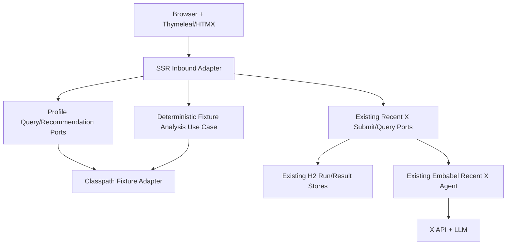
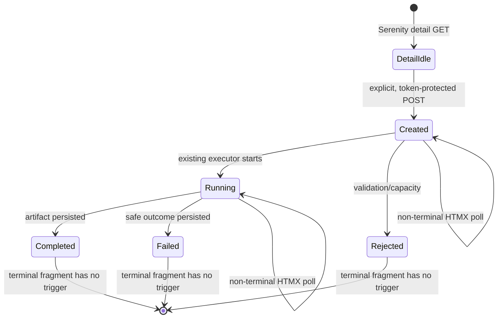
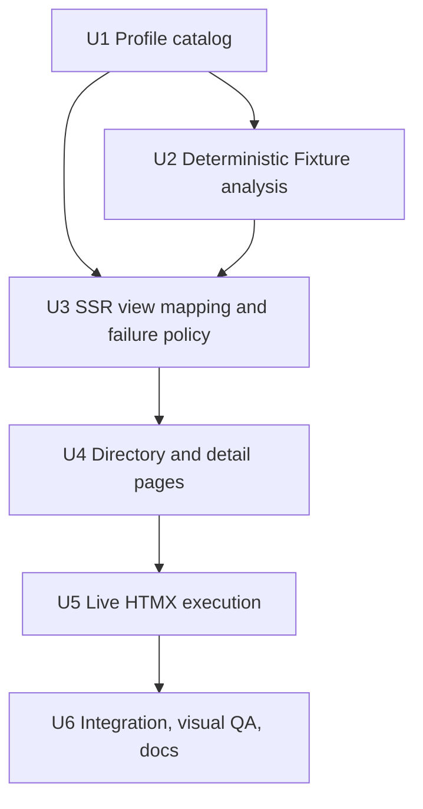
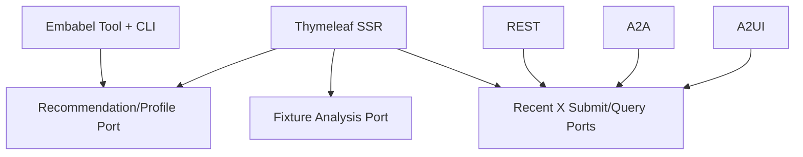

# feat: Thymeleaf 주식 인플루언서 분석 SSR 추가

## Summary

기존 추천 Tool과 최근 X 비동기 `Submit/Query` Port를 확장해 Thymeleaf 기반 네 번째 Inbound Adapter를 추가한다. Fixture 계정은 고정 데이터로 즉시 렌더링하고, Serenity는 명시적인 HTMX 요청에서만 유료 분석을 접수한 뒤 서버 렌더링 fragment로 진행 상태와 결과를 갱신한다.

---

## Problem Frame

Pinbabel은 CLI, REST, A2A, A2UI에서 핵심 Embabel 분석 기능을 실행할 수 있지만 브라우저에서 인플루언서 탐색부터 근거 확인까지 이어지는 화면이 없다. 이 계획은 기본 데모를 완전히 무비용으로 유지하면서도 실제 X/LLM 분석을 사용자가 의도적으로 실행하고 관찰할 수 있게 한다(see origin: `docs/brainstorms/2026-08-24-thymeleaf-influencer-analysis-ssr-requirements.md`).

---

## Requirements

- R1. 로그인 없이 접근하는 첫 화면에 주식 인플루언서 리스트 조회 동작을 제공한다.
- R2. 조회 동작은 전체 페이지 이동 없이 같은 화면에 정확히 10개의 프로필 카드를 렌더링하며, JavaScript가 비활성화된 경우에도 일반 링크로 목록을 확인할 수 있다.
- R3. 목록은 Serenity(`@aleabitoreddit`)와 명확히 Fixture로 표시되는 가상 인플루언서 9명으로 구성하고, 로컬 아바타 표현·표시 이름·핸들·소개·투자 성향·계정 유형을 제공한다.
- R4. Fixture 프로필 상세는 해당 프로필의 고정된 원본/인용 포스트 10개와 결정적 assessment를 사용해 X API와 LLM 호출 없이 즉시 분석 결과를 제공한다.
- R5. Serenity 프로필 진입은 외부 호출을 일으키지 않으며, 사용자가 최근 10개 분석 버튼을 명시적으로 실행한 경우에만 기존 비동기 분석을 접수한다.
- R6. 프로필과 분석 결과를 한 화면에 배치하고 회사 결과를 `POSITIVE`, `NEGATIVE`, `NEUTRAL`, `UNCERTAIN`의 `overallSentiment` 기준으로 정확히 한 영역에 분류한다.
- R7. 네 감정 영역은 결과가 없어도 유지하며, 회사명·언급 횟수·신뢰도와 펼칠 수 있는 근거를 제공한다.
- R8. 근거는 발췌문·판단 이유·작성 시각·출처를 보여준다. Serenity에는 실제 X 링크를 제공하고 Fixture에는 존재하지 않는 X 링크를 만들지 않으며 로컬 Fixture 참조임을 표시한다.
- R9. Serenity 실행 상태는 HTMX load-polling으로 자동 갱신하고 `COMPLETED`, `FAILED`, `REJECTED`에서 추가 요청을 중단한다.
- R10. 접힌 실험 정보에는 실제 run 또는 Fixture reference, 상태, X/LLM 호출 수와 예산, 실행 시간, cache/Fixture 여부, warning을 표시한다.
- R11. 실패는 기존 public outcome taxonomy를 사용자 행동으로 변환하고 credential, provider body, 내부 예외를 노출하지 않는다.
- R12. 목록·상세 탐색과 Fixture 분석은 비용이 0임을 테스트로 증명하며, 유료 실행 POST는 중복 클릭과 cross-site 제출을 막는 일회성 실행 의도 토큰을 요구한다.
- R13. 화면은 밝은 소셜 리서치 피드 스타일, 반응형 레이아웃, semantic HTML, 키보드 focus, `aria-live`, reduced-motion 대응을 제공한다.
- R14. REST, A2A, A2UI 공개 wire contract와 기존 CLI 분석 계약은 변경하지 않고 SSR이 동일한 최근 X Application Port를 소비하는지 회귀 검증한다.
- R15. 모든 화면에 공개 SNS 자동 분석이며 투자 자문이 아니라는 안내를 유지한다.

**Origin actors:** A1(실험 사용자), A2(Pinbabel 분석 시스템)

**Origin flows:** F1(인플루언서 목록 탐색), F2(Fixture 인플루언서 분석 확인), F3(Serenity 실시간 분석), F4(실시간 분석 실패 복구)

**Origin acceptance examples:** AE1(비용 없는 10명 목록), AE2(Fixture 분석과 근거), AE3(명시적 Serenity 실행과 자동 상태 갱신), AE4(안전한 credit 부족 실패), AE5(빈 감정 영역)

---

## Scope Boundaries

- 로그인, 회원, 권한, 개인화, 사용자별 저장은 추가하지 않는다. 유료 실행 의도 토큰은 인증이 아니라 SSR POST의 의도 확인과 cross-site 요청 방어다.
- 실시간 인기 순위, 검색, 임의 X 계정 추가와 실제 X 프로필 이미지 조회는 추가하지 않는다.
- 실제 시세, 주문, 포트폴리오, 투자 추천과 수익 예측은 추가하지 않는다.
- REST, A2A, A2UI의 URI, request/response, protocol version, status mapping을 변경하지 않는다.
- 기존 X 수집, Embabel Agent, prompt, 모델 선택, H2 run schema와 executor를 재설계하지 않는다.
- SSR 첫 버전에는 dark theme, SSE/WebSocket, client-side framework와 별도 frontend build pipeline을 추가하지 않는다.
- Fixture 원문을 실제 X 게시물처럼 보이게 하는 외부 링크를 만들지 않는다.

### Deferred to Follow-Up Work

- 운영 공개: 인증·인가, tenant, 운영 rate limit, durable worker와 multi-instance recovery를 별도 설계한다.
- CSR 전환: 현재 REST API를 소비하는 별도 frontend는 후속 작업으로 유지한다.
- 사용자 피드백 이후 시각 개선: 첫 구현의 실제 화면을 확인한 뒤 화면 밀도, 색상, 정렬과 콘텐츠를 반복 조정한다.

---

## Context & Research

### Relevant Code and Patterns

- `application/service/discovery/StockInfluencerRecommendationService.java`와 `RecommendXStockInfluencersUseCase`는 외부 호출 없는 추천 Tool의 기존 진입점이다.
- `application/service/discovery/RecentXAnalysisExecutionService.java`는 `CREATED -> RUNNING -> terminal` lifecycle과 H2 artifact 저장을 소유한다.
- `application/port/in/discovery/SubmitRecentXAnalysisUseCase.java`와 `QueryRecentXAnalysisUseCase.java`는 SSR이 재사용할 공통 비동기 계약이다.
- `adapter/in/rest/RecentXAnalysisRestController.java`와 `adapter/in/a2ui/A2UiRecentXAnalysisController.java`는 protocol DTO를 Application Resource로부터 별도 mapping하는 선례다.
- `application/domain/service/AnalysisFailurePolicy.java`는 X credit, rate limit, provider 장애, timeout과 configuration 실패를 안전한 공개 outcome으로 변환한다.
- `application/domain/service/RecentCompanyAnalysisService.java`는 source-grounded assessment를 회사별 요약으로 집계하므로 Fixture 결과에도 재사용한다.
- `application-live-openai.yaml`의 binding 시도 1회 제한과 최근 X Agent의 X 2회/LLM 1회 예산은 SSR에서도 변경하지 않는다.
- `build.gradle.kts`에는 Spring Boot 4.1.0의 Thymeleaf production/test starter가 이미 존재하며, 현재 `templates/`와 SSR Controller는 없다.

### Institutional Learnings

- `docs/solutions/architecture-patterns/share-one-async-execution-contract-across-rest-a2a-a2ui-2026-08-24.md`: 새 화면은 별도 상태 머신이나 실행 서비스를 만들지 않고 공통 Submit/Query Port를 사용해야 한다.
- `docs/solutions/performance-issues/pinbabel-x-sentiment-runaway-tool-loop-2026-08-24.md`: 최근 분석의 외부 호출 상한, single-flight, success cache, failure cooldown과 no-tools 단일 LLM 호출을 UI가 우회하면 안 된다.
- `docs/solutions/integration-issues/harden-x-api-timeline-integration-contracts-2026-08-24.md`: X의 불완전성, 안전한 실패와 출처 warning을 최종 화면까지 보존해야 한다.
- `docs/solutions/architecture-patterns/validate-llm-assessments-before-domain-reporting-2026-08-20.md`: 화면은 검증된 evidence만 사용하고 template에서 도메인 판단을 다시 수행하지 않는다.

### External References

- [Thymeleaf 3.1 Using Thymeleaf](https://www.thymeleaf.org/doc/tutorials/3.1/usingthymeleaf.html): `th:fragment`, `th:replace`와 natural template 패턴.
- [Thymeleaf 3.1 + Spring](https://www.thymeleaf.org/doc/tutorials/3.1/thymeleafspring.html): Spring MVC Controller와 fragment-only rendering.
- [htmx 2 documentation](https://htmx.org/docs/): 로컬 설치, target/swap, polling과 load-polling. 계획 시점 stable line은 2.0.10이며 4.x beta는 사용하지 않는다.

---

## Key Technical Decisions

### 실행 모드

| Active profiles | 목록·Fixture | Serenity 상세 | Serenity 유료 실행 |
| --- | --- | --- | --- |
| `fixture,web` | 사용 가능 | 표시 | 비활성, 설정 안내 |
| `fixture,x,live-openai,web` | 사용 가능 | 표시 | 사용 가능 |
| 기존 `fixture,api` 또는 `fixture,cli` | 기존 동작 유지 | SSR 없음 | 기존 protocol/CLI 동작 유지 |

- `application-web.yaml`은 local experiment 경계를 유지하기 위해 server를 loopback에 bind한다.
- `web` profile을 SSR의 명시적 활성화 경계로 사용한다. 기존 CLI/API profile 조합에는 SSR Controller를 자동으로 추가하지 않는다.
- 실제 분석 가능 여부는 SSR Adapter의 runtime profile readiness로 결정한다. Domain/Application에 Spring `Environment`나 profile 개념을 전달하지 않는다.

### 공통 Core와 Fixture 경계

- 추천 Tool의 Application Resource를 additive하게 확장해 stable profile ID, source type, 투자 성향과 로컬 avatar descriptor를 제공한다. CLI와 Embabel Tool은 동일한 10명 catalog를 소비한다.
- 프로필 catalog와 deterministic recent-analysis scenario는 Application-owned Outbound Port 뒤에 두고 classpath JSON Adapter가 구현한다. Controller나 Application Service에 90개 게시물 내용을 하드코딩하지 않는다.
- Fixture scenario는 10개의 post snapshot과 수동 assessment를 제공하고, 기존 `RecentCompanyAnalysisService`가 source-grounding과 집계를 수행한다. 결과 JSON을 화면에 맞춰 미리 집계해 중복 저장하지 않는다.
- Fixture 결과는 실제 `AnalysisRun`을 생성하지 않는다. 화면의 실행 참조는 `fixture:<profile-id>:v1`, 상태는 `COMPLETED`, X/LLM 호출은 0, 실행 시간은 0으로 명확히 표시한다. GET 탐색은 DB mutation을 일으키지 않는다.
- live와 Fixture 모두 `RecentMentionedCompaniesResource` 의미를 사용하고, SSR 전용 View Model로 다시 mapping한다.

### Fixture 인플루언서 구성

| Profile ID | 표시 이름 / 핸들 | 관점 | 주요 회사 표현 |
| --- | --- | --- | --- |
| `serenity` | Serenity / `@aleabitoreddit` | 실제 공개 X 계정 | live 결과에서 결정 |
| `growth-lab` | Pin Growth Lab / `@pin_growthlab` | 성장주·클라우드 | Microsoft, Amazon, Salesforce |
| `silicon-signal` | Silicon Signal / `@pin_semis` | AI·반도체 | NVIDIA, AMD, TSMC, Intel |
| `value-ledger` | Value Ledger / `@pin_value` | 가치주·산업재 | Berkshire Hathaway, Caterpillar, Deere, 3M |
| `dividend-harbor` | Dividend Harbor / `@pin_dividend` | 배당·방어주 | Coca-Cola, Procter & Gamble, Johnson & Johnson, Verizon |
| `bio-catalyst` | Bio Catalyst / `@pin_biotech` | 바이오·헬스케어 | Eli Lilly, Novo Nordisk, Moderna, Pfizer |
| `consumer-tape` | Consumer Tape / `@pin_consumer` | 소비재·리테일 | Costco, Nike, Starbucks, Target |
| `fintech-lens` | Fintech Lens / `@pin_fintech` | 결제·핀테크 | Visa, Mastercard, PayPal, Block |
| `energy-cycle` | Energy Cycle / `@pin_energy` | 전통·신재생 에너지 | Exxon Mobil, Chevron, Enphase, First Solar |
| `future-mobility` | Future Mobility / `@pin_mobility` | 전기차·모빌리티 | Tesla, GM, Uber, Rivian |

- 모든 가상 핸들은 Fixture badge와 설명을 항상 동반해 실제 계정으로 오인되지 않게 한다.
- 각 Fixture는 reply/repost를 제외한 정확히 10개의 bounded post를 갖는다. `growth-lab`은 네 감정 상태를 모두 제공해 기본 성공 데모가 되며, 다른 Fixture 일부는 특정 영역이 비어 있어 empty-state도 검증한다.
- 회사 표현은 원문 그대로 유지하고 ticker로 강제 정규화하지 않는다. 서로 충돌하는 assessment는 기존 정책대로 `UNCERTAIN`으로 접는다.
- avatar는 외부 이미지가 아니라 catalog의 initials와 승인된 color token으로 렌더링한다.

### SSR route와 HTMX fragment 계약

| Method / route | 일반 요청 | HTMX 요청 | 외부 비용 |
| --- | --- | --- | --- |
| `GET /` | 빈 directory shell | 해당 없음 | 0 |
| `GET /influencers` | 목록이 포함된 전체 page | profile-list fragment | 0 |
| `GET /influencers/{profileId}` | profile detail와 Fixture 결과 또는 live 대기 상태 | 해당 없음 | 0 |
| `POST /influencers/{profileId}/analyses` | 실행 접수 후 detail로 redirect | status fragment | live profile에서만 발생 가능 |
| `GET /influencers/{profileId}/analyses/{runId}` | 현재 결과가 포함된 전체 detail | status/result fragment | 0 |

- POST는 임의 account 문자열을 받지 않고 서버 catalog의 `serenity` profile만 실제 handle로 mapping한다.
- 한 번 사용하면 폐기되는 session-scoped 실행 의도 token을 hidden form 값으로 검증한다. 세션당 미사용 token은 하나만 유지하고 10분 뒤 만료하며, 새 token을 발급하면 이전 token을 무효화한다. 누락, 만료, 변조, 재사용 시 Submit Port를 호출하지 않는다.
- non-terminal fragment만 `load delay:2s` trigger를 포함하고 자신을 `outerHTML`로 교체한다. terminal fragment는 trigger가 없으므로 polling이 자연스럽게 끝난다. 자동 조회는 persisted run 생성 시각으로부터 120초(정상 2초 주기에서 최대 60회)가 지나면 멈추되 run 상태를 임의로 실패 처리하지 않고, 수동 상태 확인 링크와 run reference를 남긴다.
- 실행 form은 `hx-disabled-elt`로 요청 중 버튼을 비활성화하고 `hx-sync="this:drop"`으로 같은 form의 중복 요청을 버린다. Application의 single-flight와 cooldown은 최종 비용 방어선으로 그대로 유지한다.

### Failure presentation

| Public outcome | 사용자 행동 | 즉시 재시도 |
| --- | --- | --- |
| `X_API_CREDITS_REQUIRED` | X Developer Console credit 확인 후 재실행 | 조건 충족 후 허용 |
| `X_API_RATE_LIMITED` | 잠시 기다린 뒤 재실행 | 즉시 실행은 안내로 억제 |
| `X_API_TEMPORARILY_UNAVAILABLE`, `LLM_TIMEOUT`, `ANALYSIS_INTERRUPTED` | 일시 장애 안내 후 재실행 | 허용 |
| `X_CONFIGURATION_REQUIRED` | 로컬 환경 변수와 profile 설정 확인 | 설정 변경 후 허용 |
| `X_INFLUENCER_NOT_FOUND` | 고정 계정/수집 상태 확인 | 기본 비허용 |
| `EXECUTION_CAPACITY_EXCEEDED` | 진행 중 실행 종료 후 재실행 | 허용 |
| unknown/agent failure | 안전한 일반 실패와 run reference 제공 | 한 번의 수동 재실행 허용 |

- 화면은 outcome code와 안전한 안내만 사용하고 exception message, credential hint, provider response를 렌더링하지 않는다.
- invalid profile, invalid run ID, run-not-found, profile/run account mismatch와 실행 의도 token 실패는 SSR Adapter 전용 Internal Code를 registry에 추가해 추적한다.

### Visual thesis, content, interaction

- **Visual thesis:** 밝은 금융 리서치 노트와 소셜 피드의 중간 지점. warm off-white canvas, 짙은 ink, 청록 계열 단일 action accent를 사용하고 sentiment 색은 작은 label과 왼쪽 rule에만 절제해 적용한다.
- **Content plan:** home intro와 조회 action -> profile directory -> profile header와 cost/state 안내 -> 2x2 sentiment workspace -> evidence disclosure -> 접힌 experiment details -> disclaimer 순서다.
- **Interaction plan:** 목록 fragment의 짧은 staggered entrance, profile card hover/focus lift, HTMX status/result 교체의 짧은 fade를 사용한다. `prefers-reduced-motion`에서는 모두 제거한다.
- clickable profile만 card로 표현하고, 분석 결과의 sentiment 영역은 과도한 card nesting 대신 명확한 section hierarchy로 구성한다.
- native Korean font stack을 사용해 외부 font CDN을 추가하지 않는다. 1-column mobile, 2-column tablet, 3-column directory desktop과 2x2 sentiment desktop grid를 지원한다.
- 회사 근거는 native `details/summary`로 제공하고, 분석 상태 fragment에는 `aria-live="polite"`와 명시적인 텍스트 상태를 둔다.

### HTMX 자산

- htmx 2.0.10 minified asset과 upstream license를 `static/vendor/htmx/` 아래에 고정해 CDN 장애와 외부 script 신뢰를 제거한다.
- upstream checksum을 문서화하고 dependency/license 검토 대상으로 포함한다. 4.x beta는 도입하지 않는다.
- 별도 npm/Node build pipeline이나 client-side framework를 추가하지 않는다.

---

## Open Questions

### Resolved During Planning

- Fake 이름·섹터·아바타: 위 catalog 표와 initials/color token 방식으로 결정했다.
- polling 주기와 중단: 2초 load-polling이며 terminal fragment 또는 run 생성 후 120초(최대 60회) 자동 조회 budget 도달 시 trigger를 제거하고 수동 상태 확인을 남긴다.
- public failure mapping: 기존 `AnalysisFailurePolicy` outcome을 위 사용자 행동 표로 presentation한다.
- live 설정 없는 모드: Serenity는 보이지만 action은 설정 안내로 대체한다.
- Fixture 원문 링크: 가짜 X URL 대신 Fixture reference를 표시한다.

### Deferred to Implementation

- 최종 문구 줄바꿈과 각 Fixture post의 자연스러운 세부 문장: fixture invariant와 회사·sentiment matrix를 유지하면서 구현 시 작성한다.
- 브라우저별 미세한 line-height와 animation duration: 첫 렌더 screenshot에서 접근성과 visual thesis를 해치지 않는 범위로 조정한다.
- Spring Boot가 실제 resolve한 Thymeleaf patch version: 실행 시작 시 dependency insight로 확인하되 version migration은 이 작업에 포함하지 않는다.

---

## Output Structure

```text
src/main/java/com/ypkim/pinbabel/influenceranalysis/
├── adapter/in/web/
│   ├── InfluencerDirectoryWebController.java
│   ├── RecentXAnalysisWebController.java
│   ├── SsrAnalysisFailurePresenter.java
│   ├── SsrExecutionIntentTokenManager.java
│   ├── SsrLiveAnalysisAvailability.java
│   └── view/
├── adapter/out/fixture/
│   └── FixtureStockInfluencerCatalog.java
├── application/domain/model/
│   └── profile/
├── application/port/in/discovery/
├── application/port/out/discovery/
└── application/service/discovery/

src/main/resources/
├── application-web.yaml
├── fixtures/influenceranalysis/stock-influencer-profiles-v1.json
├── templates/influenceranalysis/
│   ├── home.html
│   ├── detail.html
│   └── fragments/
└── static/
    ├── css/pinbabel.css
    └── vendor/htmx/
```

이 tree는 소유권과 경계를 보여주는 범위 선언이다. 구현 중 class 수를 줄일 수 있더라도 Domain/Application/View Model 경계를 합치지는 않는다.

---

## High-Level Technical Design

> *This illustrates the intended approach and is directional guidance for review, not implementation specification. The implementing agent should treat it as context, not code to reproduce.*





---

## Change-Signal Routing

| 신호 | 근거 | 필수 참조 | 적용 결과 | 상태 |
| --- | --- | --- | --- | --- |
| 스킬 정책·검사 자산 | 프로젝트 스킬 자체는 수정하지 않는다 | rule ownership, architecture compliance, build verification | 기존 compliance asset만 실행 | N/A |
| 모든 Java 백엔드 코드 | Domain, Port, Service, Controller, mapper, test 추가 | architecture, coding, Java, readability, industry, unit/negative, compliance/build | Java 25, Full Mapping, unit/negative와 clean build 적용 | Required |
| HTTP Endpoint/Web 계약 | 신규 HTML page, fragment GET/POST | coding, full mapping, API design, Swagger, error, security, negative | SSR route/view model mapping, method semantics, bounded form, error fragment 검증. JSON API가 아니므로 OAS annotation은 적용하지 않음 | Required |
| 인증·인가/사용자 경계 | 로그인 없음, local-public SSR, 유료 POST 의도 확인 | identity/error/Swagger/negative | 운영 auth는 제외하고 loopback, same-origin HTMX와 one-time token으로 비용 action 방어 | Required |
| Application/Domain 모델·행위 | profile identity/source type, Fixture query use case | architecture, DDD, hexagonal, vertical slice, full mapping | profile Domain과 Application Resource, Outbound fixture mapping 분리 | Required |
| Slice/module 경계 | 동일 `influenceranalysis` Slice 안에 새 Adapter/Port 추가 | module structure, modulith, vertical slice, hexagonal | cross-slice 의존 없이 새 package를 module verification에 포함 | Required |
| transaction/둘 이상의 변경 자원 | Fixture GET은 무상태, live는 기존 run 저장 + 외부 분석 | module structure, saga, industry, error | 기존 multi-step 비동기 경계를 재사용하며 새 transaction/Saga를 만들지 않음 | N/A |
| 비동기/published event | 기존 bounded executor와 operation polling을 사용 | module structure, durable events, saga, modulith | 새 event contract 없이 existing run lifecycle을 조회 | Required |
| 외부 시스템 I/O | live action이 기존 X/LLM path를 호출 | hexagonal, saga, industry, error, negative | SSR은 Outbound Adapter를 직접 호출하지 않고 기존 timeout/비용/실패 정책을 보존 | Required |
| Persistence/DB | 기존 H2 run/result query를 SSR에서 사용하지만 repository/entity는 미변경 | hexagonal, industry, error, internal code, negative | Query Port만 사용하고 persistence type을 View에 노출하지 않음 | N/A |
| DB schema/migration | 새 table/column/index가 없음 | coding, Liquibase, industry, negative, build | changelog 미변경, 기존 Liquibase validator는 final build에서 실행 | N/A |
| 검색·필터·목록 조회 | 고정 10명 bounded catalog, pagination/filter 없음 | RSQL, full mapping, API design, Swagger, negative | 범용 검색/RSQL/Pageable을 도입하지 않고 결정적 catalog 순서 검증 | N/A |
| Projection·Streaming·파일·비동기 Operation 조회 | H2 run status를 HTML fragment로 polling | full mapping, API design, Swagger, security, negative | Application Read Model -> SSR View Model, terminal stop와 not-found 검증 | Required |
| 외부 URL·파일·고비용 입력 | profile/run path와 유료 POST, vendored JS | security, hexagonal, industry, negative | server-owned profile mapping, bounded ID/token, checksum/license와 no-CDN 적용 | Required |
| 예외 또는 오류 경로 | fixture parse, profile/run/token, live outcome mapping | internal code, error, negative | 고유 Internal Code와 safe HTML error presentation 추가 | Required |
| Internal Code/error catalog | 신규 SSR/fixture 오류 occurrence | internal code, error, build | registry/declaration/occurrence를 같은 단위에서 갱신 | Required |
| dependency/plugin/build | Gradle dependency는 이미 존재, vendored htmx asset 추가 | coding, security, compliance, build | Thymeleaf resolved version 확인, htmx stable pin/checksum/license와 vulnerability 검토 | Required |
| 구조 이동/대규모 refactor | 기존 세 protocol이나 X Agent package를 이동하지 않음 | architecture/module/DDD/hexagonal/modulith/full mapping | 필요한 additive Port와 Adapter만 추가 | N/A |
| 문서·정책만 변경 | parity/README와 계획을 갱신하지만 코드 변경도 예정 | rule ownership, topic owner, build | executable behavior는 code verification에 포함 | N/A |

기존 public REST/A2A/A2UI wire contract의 변경은 없으므로 Breaking Change 승인 게이트는 발생하지 않는다. 추천 Tool resource에 profile metadata를 additive하게 확장하는 계약 변경은 사용자가 “기존 Tool 개조”를 명시적으로 요청한 범위이며, 기존 필드를 제거하거나 의미를 변경하지 않는다.

---

## Implementation Units



### U1. Curated profile catalog와 추천 Tool 확장

**Goal:** Serenity와 9개 Fixture profile의 안정적인 identity, metadata, ordering과 avatar descriptor를 Core/Adapter 경계로 제공하고 기존 추천 Tool이 같은 catalog를 반환하게 한다.

**Requirements:** R2, R3, R12, R14; F1; AE1

**Dependencies:** None

**Files:**
- Create: `src/main/java/com/ypkim/pinbabel/influenceranalysis/application/domain/model/profile/InfluencerProfileId.java`
- Create: `src/main/java/com/ypkim/pinbabel/influenceranalysis/application/domain/model/profile/InfluencerProfileSource.java`
- Create: `src/main/java/com/ypkim/pinbabel/influenceranalysis/application/domain/model/profile/StockInfluencerProfile.java`
- Create: `src/main/java/com/ypkim/pinbabel/influenceranalysis/application/port/out/discovery/StockInfluencerProfileCatalog.java`
- Create: `src/main/java/com/ypkim/pinbabel/influenceranalysis/adapter/out/fixture/FixtureStockInfluencerCatalog.java`
- Create: `src/main/resources/fixtures/influenceranalysis/stock-influencer-profiles-v1.json`
- Modify: `src/main/java/com/ypkim/pinbabel/influenceranalysis/application/port/in/discovery/dto/XStockInfluencerRecommendationResource.java`
- Modify: `src/main/java/com/ypkim/pinbabel/influenceranalysis/application/service/discovery/StockInfluencerRecommendationService.java`
- Modify: `src/main/java/com/ypkim/pinbabel/influenceranalysis/adapter/in/cli/PinbabelCliRenderer.java`
- Modify: `config/internal-code/registry.json`
- Modify: `src/main/java/com/ypkim/pinbabel/influenceranalysis/application/domain/error/InfluencerAnalysisInternalCode.java`
- Test: `src/test/java/com/ypkim/pinbabel/influenceranalysis/adapter/out/fixture/FixtureStockInfluencerCatalogTest.java`
- Test: `src/test/java/com/ypkim/pinbabel/influenceranalysis/application/service/discovery/StockInfluencerRecommendationServiceTest.java`
- Test: `src/test/java/com/ypkim/pinbabel/influenceranalysis/application/service/tool/StockInfluencerDiscoveryToolsTest.java`
- Test: `src/test/java/com/ypkim/pinbabel/influenceranalysis/adapter/in/cli/PinbabelDiscoveryShellCommandsTest.java`

**Approach:**
- Model profile ID as a validated natural-key Value Object and source as an exhaustive enum. Keep avatar color as a small allowlisted token, never arbitrary CSS from JSON.
- Read the versioned catalog once into an immutable, deterministic order. Preserve Serenity as the first entry and reject duplicate profile IDs/handles, unsupported source values, invalid X handles and catalog sizes other than 10.
- Keep the existing recommendation fields and add metadata required by SSR. Continue reporting `xApiUsed=false`, `llmUsed=false`.
- Assign Fixture read/validation failures registered Internal Codes; do not leak classpath paths or Jackson messages.

**Execution note:** Implement catalog invariants and negative tests before changing the Tool resource.

**Patterns to follow:**
- `adapter/out/fixture/FixtureGoldenDatasetSource.java` for bounded classpath JSON parsing and error translation.
- `application/domain/model/XAccountHandle.java` for handle validation.
- Existing jMolecules Domain/Port annotations and package-level architecture tests.

**Test scenarios:**
- Covers F1 / AE1. Happy path: load catalog -> exact 10 profiles, Serenity first, 1 `LIVE_X` and 9 `FIXTURE`, all required presentation metadata present.
- Happy path: call recommendation Tool twice -> equal immutable results and zero X/LLM use flags.
- Edge case: all profile IDs and handles are unique and every avatar token belongs to the allowed palette.
- Error path: duplicate ID, invalid handle, blank description, unsupported source or wrong catalog size -> fixture-specific safe Internal Code.
- Regression: CLI and Embabel Tool still expose prior fields while returning the expanded 10-profile catalog.

**Verification:** 추천 Tool, CLI와 future SSR이 하나의 immutable catalog를 사용하고 catalog 조회만으로 외부 Port가 호출되지 않는다.

### U2. 비용 없는 deterministic Fixture 분석

**Goal:** 각 가상 profile의 10개 post/assessment fixture를 기존 source-grounded 집계 규칙으로 분석해 live 결과와 같은 Application 의미로 반환한다.

**Requirements:** R4, R6, R7, R8, R10, R12, R15; F2; AE2, AE5

**Dependencies:** U1

**Files:**
- Create: `src/main/java/com/ypkim/pinbabel/influenceranalysis/application/port/in/discovery/QueryFixtureStockInfluencerAnalysisUseCase.java`
- Create: `src/main/java/com/ypkim/pinbabel/influenceranalysis/application/port/out/discovery/FixtureRecentAnalysisSource.java`
- Create: `src/main/java/com/ypkim/pinbabel/influenceranalysis/application/port/out/discovery/dto/FixtureRecentAnalysisScenario.java`
- Create: `src/main/java/com/ypkim/pinbabel/influenceranalysis/application/service/discovery/FixtureStockInfluencerAnalysisService.java`
- Modify: `src/main/java/com/ypkim/pinbabel/influenceranalysis/adapter/out/fixture/FixtureStockInfluencerCatalog.java`
- Modify: `src/main/resources/fixtures/influenceranalysis/stock-influencer-profiles-v1.json`
- Modify: `config/internal-code/registry.json`
- Modify: `src/main/java/com/ypkim/pinbabel/influenceranalysis/application/domain/error/InfluencerAnalysisInternalCode.java`
- Test: `src/test/java/com/ypkim/pinbabel/influenceranalysis/adapter/out/fixture/FixtureStockInfluencerCatalogTest.java`
- Test: `src/test/java/com/ypkim/pinbabel/influenceranalysis/application/service/discovery/FixtureStockInfluencerAnalysisServiceTest.java`
- Test: `src/test/java/com/ypkim/pinbabel/influenceranalysis/InfluencerAnalysisPackageArchitectureTest.java`

**Approach:**
- Store exactly 10 bounded posts and manually reviewed mention assessments per Fixture profile. Do not include replies or reposts.
- Let the fixture Adapter map provider-shaped JSON to `CollectedPosts`, assessments and the analyzed-text snapshot; let the Application Service call `RecentCompanyAnalysisService` rather than trusting pre-aggregated UI output.
- Map the result to `RecentMentionedCompaniesResource` with calls/budgets `0/0`, duration `0`, no live cache claim, `FIXTURE_DATA_NOT_LIVE` warning and the investment-advice disclaimer.
- Use deterministic `urn:pinbabel:fixture:<profile>:post:<id>` source references. The later View mapper renders them as Fixture labels, not external anchors.

**Patterns to follow:**
- `RecentCompanyAnalysisService` for mention grounding, duplicate collapse, conflicting assessment handling and confidence calculation.
- `FixtureGoldenDatasetSource` for versioned fixture validation.

**Test scenarios:**
- Covers F2 / AE2. Happy path: query `growth-lab` -> 10 analyzed posts, all four overall sentiment groups represented, evidence grounded in supplied post text, zero external call counts.
- Covers AE5. Happy path: query a profile with no negative summary -> valid completed result whose negative group can be rendered empty.
- Edge case: assessment references unknown post or absent company expression -> existing grounding warning and no hallucinated company in output.
- Edge case: duplicate/conflicting assessment -> duplicate ignored or one `UNCERTAIN` evidence according to existing policy.
- Error path: live `serenity` or unknown profile requested from Fixture use case -> empty Optional/safe not-applicable result without X/LLM invocation.
- Invariant: every Fixture has exactly 10 unique non-reply/non-repost posts and at least one evidence-backed company mention.

**Verification:** Fixture detail은 네트워크, AgentPlatform, LLM bean과 무관하게 결정적으로 실행되며 동일 입력에서 동일 결과를 반환한다.

### U3. SSR View Model, sentiment grouping과 failure presentation

**Goal:** Application Resource를 Thymeleaf 전용 View Model로 full-map하고 네 감정 영역, 실험 정보, live readiness와 안전한 실패 행동을 template 밖에서 결정한다.

**Requirements:** R5, R6, R7, R8, R10, R11, R13, R14, R15; F2, F3, F4

**Dependencies:** U1, U2

**Files:**
- Create: `src/main/java/com/ypkim/pinbabel/influenceranalysis/adapter/in/web/view/InfluencerDirectoryViewModel.java`
- Create: `src/main/java/com/ypkim/pinbabel/influenceranalysis/adapter/in/web/view/InfluencerProfileViewModel.java`
- Create: `src/main/java/com/ypkim/pinbabel/influenceranalysis/adapter/in/web/view/RecentAnalysisViewModel.java`
- Create: `src/main/java/com/ypkim/pinbabel/influenceranalysis/adapter/in/web/InfluencerAnalysisWebViewMapper.java`
- Create: `src/main/java/com/ypkim/pinbabel/influenceranalysis/adapter/in/web/SsrAnalysisFailurePresenter.java`
- Create: `src/main/java/com/ypkim/pinbabel/influenceranalysis/adapter/in/web/SsrLiveAnalysisAvailability.java`
- Create: `src/main/java/com/ypkim/pinbabel/influenceranalysis/adapter/in/web/SsrRequestException.java`
- Create: `src/main/java/com/ypkim/pinbabel/influenceranalysis/adapter/in/web/SsrRequestExceptionHandler.java`
- Modify: `config/internal-code/registry.json`
- Modify: `src/main/java/com/ypkim/pinbabel/influenceranalysis/application/domain/error/InfluencerAnalysisInternalCode.java`
- Test: `src/test/java/com/ypkim/pinbabel/influenceranalysis/adapter/in/web/InfluencerAnalysisWebViewMapperTest.java`
- Test: `src/test/java/com/ypkim/pinbabel/influenceranalysis/adapter/in/web/SsrAnalysisFailurePresenterTest.java`
- Test: `src/test/java/com/ypkim/pinbabel/influenceranalysis/adapter/in/web/SsrLiveAnalysisAvailabilityTest.java`
- Test: `src/test/java/com/ypkim/pinbabel/influenceranalysis/adapter/in/web/SsrRequestExceptionHandlerTest.java`

**Approach:**
- Keep View Models exclusively in the SSR Adapter. Do not put Thymeleaf/Spring MVC annotations or display strings into Domain/Application records.
- Compute mention count as the sum of sentiment counts and confidence as a presentation percentage. Group every company once by `overallSentiment`; do not classify by “any positive count”.
- Always create four ordered sentiment section models, including explicit empty-state copy.
- Represent live run ID and Fixture reference with a tagged view value so a Fixture identifier cannot be parsed as `AnalysisRunId`.
- Map only allowlisted public outcomes to guidance and retry state. Unknown outcomes use generic safe text while preserving run reference for diagnosis. Render an external evidence anchor only when the URI is HTTPS on the exact `x.com` host; all other schemes/hosts and Fixture URNs become non-clickable source labels.
- Resolve live readiness in the SSR Adapter from active `x` and `live-openai` profiles through `SsrLiveAnalysisAvailability`; expose only enabled/disabled and safe setup guidance to View Models, never Spring `Environment` or credential values to Application/Domain.
- Use one HTML error view/fragment shape for full-page and HTMX errors while keeping existing REST `PinbabelApiErrorResponse` untouched.

**Patterns to follow:**
- `adapter/in/rest/RecentXAnalysisDetailResponse.java` for explicit Resource-to-boundary mapping.
- `AnalysisFailurePolicy` for public outcome taxonomy; SSR adds presentation only.

**Test scenarios:**
- Happy path: mixed company summaries -> exactly one company per matching overall sentiment section and correct total mention count/confidence percentage.
- Covers AE5. Edge case: no companies or no entries for one sentiment -> all four section models remain present with empty state.
- Edge case: Fixture URI -> non-clickable Fixture reference; exact `https://x.com/...` URI -> safe external link metadata with `noopener noreferrer`; deceptive subdomain, non-HTTPS or other host -> non-clickable label.
- Covers F4 / AE4. Error path: each known live outcome -> expected recovery category and retry availability without provider detail.
- Error path: unknown outcome and exception with secret-like message -> generic view contains neither secret-like text nor raw cause.
- Error path: invalid profile/run/token paths -> distinct registered Internal Codes and correct full-page versus fragment presentation.

**Verification:** templates가 enum 분기, 비용 판단, outcome 해석이나 Domain aggregation을 소유하지 않고 준비된 View Model만 렌더링한다.

### U4. Thymeleaf directory와 profile detail 화면

**Goal:** home -> HTMX directory -> profile detail -> Fixture result의 완전한 무비용 SSR 흐름과 bright social-research visual system을 구현한다.

**Requirements:** R1-R8, R10, R13, R15; F1, F2; AE1, AE2, AE5

**Dependencies:** U3

**Files:**
- Create: `src/main/java/com/ypkim/pinbabel/influenceranalysis/adapter/in/web/InfluencerDirectoryWebController.java`
- Create: `src/main/java/com/ypkim/pinbabel/influenceranalysis/adapter/in/web/package-info.java`
- Create: `src/main/resources/application-web.yaml`
- Create: `src/main/resources/templates/influenceranalysis/home.html`
- Create: `src/main/resources/templates/influenceranalysis/detail.html`
- Create: `src/main/resources/templates/influenceranalysis/fragments/profile-list.html`
- Create: `src/main/resources/templates/influenceranalysis/fragments/profile-header.html`
- Create: `src/main/resources/templates/influenceranalysis/fragments/analysis-panel.html`
- Create: `src/main/resources/templates/influenceranalysis/fragments/error-panel.html`
- Create: `src/main/resources/static/css/pinbabel.css`
- Create: `src/main/resources/static/vendor/htmx/htmx-2.0.10.min.js`
- Create: `src/main/resources/static/vendor/htmx/LICENSE`
- Test: `src/test/java/com/ypkim/pinbabel/influenceranalysis/adapter/in/web/InfluencerDirectoryWebControllerTest.java`
- Test: `src/test/java/com/ypkim/pinbabel/influenceranalysis/adapter/in/web/WebProfileIntegrationTest.java`

**Approach:**
- Activate the Controller only under `fixture & web`, annotate it as a Primary Adapter and bind the web profile to `127.0.0.1`.
- `GET /influencers` returns the full home with list for normal navigation and only `profile-list` for `HX-Request=true`.
- Server-render Fixture result on detail GET, so clicking a Fixture profile makes no follow-up AJAX or external call.
- Render semantic `main`, `section`, `article`, `nav`, `button`, `details` elements; keep visible focus and keyboard-operable cards/evidence.
- Encode the approved color/spacing/type tokens as CSS custom properties. Use responsive CSS grid and reduced-motion media query without adding a CSS framework.
- Include vendored htmx through a local static path. Preserve natural HTML fallback for the list link.

**Execution note:** Start with MockMvc rendered-HTML contract tests for the two acceptance flows, then implement templates and styling.

**Patterns to follow:**
- Thymeleaf official fragment rendering with `th:fragment`/`th:replace`.
- Existing `ApiProfileIntegrationTest` for profile-scoped application startup and MockMvc integration.

**Test scenarios:**
- Covers F1 / AE1. Integration: `fixture,web` GET `/` then HTMX GET `/influencers` -> fragment contains exactly 10 profile articles and no full document wrapper.
- Progressive fallback: normal GET `/influencers` -> full page with the same ordered 10 profiles.
- Covers F2 / AE2. Integration: GET Fixture detail -> completed analysis, four sentiment sections, evidence disclosure, experiment details and disclaimer in one response.
- Covers AE5. Edge case: empty sentiment group -> section and “결과 없음” state remain in DOM.
- Error path: unknown profile -> safe not-found page/fragment and no fixture/live analysis Port invocation.
- Security: generated text uses escaped Thymeleaf output; Fixture content containing HTML/script-like text is displayed as text, not executable markup.
- Accessibility: one H1, labeled action, semantic regions, focusable profile links, `details/summary`, non-color sentiment labels and reduced-motion rule exist.
- Configuration: without `web` profile the SSR routes are absent; with `fixture,web` the app starts without X/LLM credentials.

**Verification:** 사용자는 외부 비용 없이 조회 버튼부터 Fixture 근거까지 흐름을 완료하고, 화면은 mobile/desktop에서 읽을 수 있다.

### U5. Serenity 유료 실행, HTMX polling과 비용 action 보호

**Goal:** Serenity detail에서만 명시적이고 중복 방지된 live 분석을 접수하고, 기존 run lifecycle을 HTMX fragment로 terminal까지 표시한다.

**Requirements:** R5, R9-R12, R14, R15; F3, F4; AE3, AE4

**Dependencies:** U4

**Files:**
- Create: `src/main/java/com/ypkim/pinbabel/influenceranalysis/adapter/in/web/RecentXAnalysisWebController.java`
- Create: `src/main/java/com/ypkim/pinbabel/influenceranalysis/adapter/in/web/SsrExecutionIntentTokenManager.java`
- Modify: `src/main/java/com/ypkim/pinbabel/influenceranalysis/adapter/in/web/InfluencerDirectoryWebController.java`
- Modify: `src/main/resources/templates/influenceranalysis/detail.html`
- Modify: `src/main/resources/templates/influenceranalysis/fragments/analysis-panel.html`
- Modify: `src/main/resources/static/css/pinbabel.css`
- Modify: `config/internal-code/registry.json`
- Modify: `src/main/java/com/ypkim/pinbabel/influenceranalysis/application/domain/error/InfluencerAnalysisInternalCode.java`
- Test: `src/test/java/com/ypkim/pinbabel/influenceranalysis/adapter/in/web/RecentXAnalysisWebControllerTest.java`
- Test: `src/test/java/com/ypkim/pinbabel/influenceranalysis/adapter/in/web/SsrExecutionIntentTokenManagerTest.java`
- Test: `src/test/java/com/ypkim/pinbabel/influenceranalysis/adapter/in/web/RecentXWebPortParityTest.java`

**Approach:**
- Enable the live execution Controller only with `fixture & x & live-openai & web`. In fixture-only web mode, detail remains available and shows setup guidance.
- Resolve the submitted profile server-side and reject non-live profiles before calling `SubmitRecentXAnalysisUseCase`.
- Issue a high-entropy, session-scoped, single-use token on live detail render; retain at most one outstanding token per session, expire it after 10 minutes, and validate/consume it atomically on POST. Require same-origin HTMX header for fragment submission while retaining a normal POST redirect fallback with the token.
- Return the first status fragment from the Application submission. Poll only `QueryRecentXAnalysisUseCase`; never call the synchronous analysis Port or repositories.
- For non-terminal status include the 2-second load trigger and `aria-live`. Derive elapsed time from the persisted run creation time, stop automatic polling after 120 seconds (at most 60 normal polls) without changing the Application run status, and render a manual status-check link. For terminal status render results/failure and omit polling attributes.
- Validate `AnalysisRunId`, require the returned account to equal Serenity's catalog handle and map missing/mismatched runs to not-found rather than leaking another run.
- Regenerate a new intent token only when a terminal failure is eligible for manual retry. A used token never becomes valid again.

**Patterns to follow:**
- `RecentXAnalysisRestController` for Submit/Query Port usage and run ID parsing.
- `RecentXAnalysisExecutionService` for status truth; do not duplicate lifecycle transitions in the Adapter.
- htmx official load-polling/outerHTML pattern.

**Test scenarios:**
- Covers F3 / AE3. Happy path: Serenity GET -> no submit; valid POST -> exactly one submit; CREATED/RUNNING polls -> no resubmit; COMPLETED -> results and no polling trigger.
- Edge case: `fixture,web` without live profiles -> Serenity visible, action disabled/setup guidance, no live Port bean required.
- Cost guard: double submission with the same token -> one submit only; reused/missing/foreign-session token -> rejection and zero submit calls.
- Cost guard: token expiry and replacement -> expired/replaced token is rejected, token storage remains bounded to one outstanding value per session and zero submit calls occur.
- Cost guard: Fixture profile POST -> rejected before live Port invocation.
- Error path: malformed/missing run, account mismatch or missing result -> safe not-found fragment with unique Internal Code.
- Covers F4 / AE4. Failure path: credit required -> safe credit guidance, no credential/provider body and retry token only after a fresh render.
- Failure path: rate limit -> waiting guidance; transient X/LLM failure -> manual retry; terminal fragment contains no polling attributes.
- Polling bound: a run still non-terminal 120 seconds after creation -> no further automatic trigger, run remains non-terminal, manual status check and run reference remain visible.
- Integration: SSR, REST, A2A and A2UI test doubles receive the same Serenity handle through the same `SubmitRecentXAnalysisUseCase` contract without changing existing protocol DTOs.

**Verification:** 프로필 탐색만으로는 live 호출이 없고 한 번의 승인된 사용자 action만 실행을 접수하며, polling은 읽기 전용이고 terminal에서 멈춘다.

### U6. Cross-layer 검증, visual QA와 운영 문서

**Goal:** 비용 없는 기본 흐름, live profile wiring, 네 Inbound surface의 Port parity, architecture/compliance와 실제 렌더 품질을 최종 검증하고 실행 방법을 문서화한다.

**Requirements:** R1-R15; F1-F4; AE1-AE5

**Dependencies:** U4, U5

**Files:**
- Modify: `src/test/java/com/ypkim/pinbabel/influenceranalysis/InfluencerAnalysisPackageArchitectureTest.java`
- Modify: `src/test/java/backend/compliance/BackendArchitectureComplianceTest.java`
- Create: `src/test/java/com/ypkim/pinbabel/influenceranalysis/adapter/in/web/SsrAcceptanceIntegrationTest.java`
- Modify: `src/test/java/com/ypkim/pinbabel/influenceranalysis/adapter/in/RecentXProtocolAdapterParityTest.java`
- Modify: `README.md`
- Modify: `docs/api-protocol-parity.md`
- Create: `docs/guides/ssr.md`

**Approach:**
- Add the SSR column to protocol parity documentation: the same Application Port and lifecycle are shared, while SSR transports HTML fragments and supports browser polling.
- Document `fixture,web` as the zero-cost default and `fixture,x,live-openai,web` as explicit live mode with required local environment variables. Never copy credential values into docs or tests.
- Verify the architecture rules recognize `adapter.in.web` as a Primary Adapter and prohibit Domain/Application dependencies on Spring MVC, Thymeleaf and View Models.
- Start the application in zero-cost mode, use the available browser tooling for one screenshot-based desktop/mobile pass, and fix only glaring layout, overflow, focus or readability defects. Live X/LLM smoke is excluded unless separately approved because it spends money.

**Patterns to follow:**
- Existing `ProtocolAdapterParityTest`, `RecentXProtocolAdapterParityTest` and compliance tests.
- `docs/api-protocol-parity.md` capability table and local-only execution notes.

**Test scenarios:**
- Covers AE1-AE5. Full MockMvc acceptance: directory, Fixture detail, empty state, live idle, live progress, terminal success and safe failure.
- Cost assertion: a spy X/LLM/live submit boundary receives zero calls during home, list and every Fixture detail test.
- Profile integration: `fixture,web` starts without secrets; live Controller presence is limited to the complete live profile set.
- Architecture: Controller calls Primary Ports only; no repository, X Adapter, Embabel Agent, Domain Model or protocol DTO leaks into View Models/templates.
- Regression: existing REST/A2A/A2UI/CLI contract tests still pass and their route/media/version assertions remain unchanged.
- Asset: local htmx file matches pinned checksum/license metadata and templates contain no external script/font CDN.
- Visual: 390px mobile and desktop viewport show no horizontal overflow, readable four-section layout, visible focus and coherent loading/terminal states.

**Verification:** 모든 deterministic 테스트와 architecture/compliance가 통과하고, 실제 화면 screenshot이 visual thesis와 핵심 사용자 흐름을 확인하며, live smoke 없이도 기능 완료를 증명한다.

---

## System-Wide Impact



- **Interaction graph:** 추천 Tool/CLI와 SSR이 profile catalog를 공유하고, SSR/REST/A2A/A2UI가 live Submit/Query Port를 공유한다. Fixture 분석은 SSR의 zero-cost demo query로만 사용하지만 Core/Adapter 경계를 유지한다.
- **Error propagation:** Fixture parse 오류는 Adapter -> domain exception/Internal Code -> SSR safe error view로, live provider 오류는 기존 `AnalysisFailurePolicy` -> stored outcome -> SSR presenter로 흐른다.
- **State lifecycle risks:** Fixture GET은 상태를 변경하지 않는다. live run은 기존 H2 lifecycle을 사용하며 일회성 token은 HTTP session 범위의 비용 action 보호일 뿐 run의 Source of Truth가 아니다.
- **API surface parity:** 기존 세 protocol wire contract는 그대로다. 추천 Tool의 metadata는 additive하며 SSR이 네 번째 Inbound surface로 parity 문서에 추가된다.
- **Integration coverage:** profile 조건부 wiring, template rendering, HTMX fragment contract, terminal polling stop, zero-cost assertion은 단위 테스트만으로 증명할 수 없어 MockMvc/profile integration과 browser QA가 필요하다.
- **Unchanged invariants:** X 최대 2회, LLM 최대 1회, replies/reposts 제외, success cache 15분, failure cooldown 1분, provider secret 비노출, H2/Liquibase schema와 Embabel-only AI 경계는 변하지 않는다.

---

## Compatibility and Approval Gates

- **REST/A2A/A2UI:** URI, payload, status와 version 변경 없음. Breaking Change 없음.
- **CLI/Embabel Tool:** 기존 recommendation 필드는 유지하고 profile metadata와 9개 Fixture 항목을 추가한다. 사용자가 요청한 Tool 확장 범위이며 제거/rename은 하지 않는다.
- **Database:** schema와 migration 없음. Liquibase changeSet 추가 없음.
- **Events/transactions:** 새 published event, transaction, Saga 없음.
- **Security:** 운영 인증을 추가하거나 기존 public/protected 의미를 변경하지 않는다. SSR은 loopback 실험 profile이며 외부 공개는 별도 승인 대상이다.
- **Dependency:** Gradle에는 Thymeleaf starter가 이미 있다. htmx는 stable vendored asset으로 추가하며 새 repository/plugin이 없다.

구현 중 기존 public JSON/protocol contract, DB schema, 외부 destination 또는 security classification 변경이 필요하다고 드러나면 현재 계획을 중단하고 영향 보고와 사용자 승인을 먼저 받는다.

---

## Risks & Dependencies

| Risk | Mitigation |
| --- | --- |
| profile detail 진입이 실수로 유료 분석을 시작함 | GET은 query/render만 수행하고 token-protected POST만 Submit Port 호출; cost-spy acceptance test |
| double click/cross-site POST가 중복 비용을 발생시킴 | 10분 TTL·세션당 1개로 bounded한 single-use token, HTMX request dedupe/disabled button, existing single-flight와 failure cooldown |
| polling이 terminal 이후 또는 비정상 장기 run에서 계속됨 | terminal fragment에는 trigger를 제거하고 persisted run 생성 시각 기준 120초(최대 60회) 뒤 수동 확인으로 전환하는 DOM contract test |
| Fixture가 실제 인플루언서나 실제 게시물처럼 보임 | Fixture badge, project-prefixed handle, URN reference, 외부 X link 금지와 disclaimer |
| View template가 Domain 판단을 복제함 | Application Resource -> SSR View Model mapper에서 grouping/failure/readiness를 끝내고 template는 표시만 담당 |
| SSR profile가 기존 CLI/API startup을 방해함 | `web` profile 격리와 profile integration tests |
| vendored JS가 노후화되거나 provenance를 잃음 | stable 2.0.10 pin, upstream license/checksum, 명시적인 후속 upgrade 절차 |
| 90개 Fixture가 중복·부정합해짐 | versioned single catalog, schema/invariant tests, post/assessment evidence cross-check |
| 실제 live run이 다른 profile 화면에 노출됨 | run account와 server-owned catalog handle 일치 검증 후 렌더 |
| 화면 디자인이 데이터 밀도나 접근성을 해침 | semantic markup, AA contrast/focus, reduced motion, mobile/desktop screenshot QA 한 번 수행 |

---

## Verification Matrix

| 검증 영역 | Required/N/A | 판단 근거 | 실행 task/command | final build 연결 여부 |
| --- | --- | --- | --- | --- |
| Always-On | Required | Java, resource, HTML/CSS/JS와 test 변경 | 관련 unit/MockMvc/profile tests, Modulith, ArchUnit, Internal Code, Liquibase validator, full clean build | 예, 확인 필요 |
| API·DTO·Mapping | Required | 신규 SSR routes, form, fragment, View Model mapping | web controller/mapper/HTML contract integration tests | 예 |
| RSQL·Pagination | N/A | 고정 10명 catalog이며 filter, Pageable, cursor가 없음 | catalog size/order test | N/A |
| Persistence·Transaction | N/A | repository/entity/transaction 수정 없음; 기존 Query Port만 사용 | 기존 persistence suite는 final build에서 회귀 실행 | 예 |
| Liquibase | N/A | schema/changelog 변경 없음 | existing `validateLiquibaseChangeSets` | 예 |
| Cross-Slice | N/A | 하나의 `influenceranalysis` Slice 내부 변경 | Modulith/ArchUnit verification | 예 |
| Durable Event | N/A | 새 event/publication/outbox 없음 | existing Modulith verification | 예 |
| Saga | N/A | 새 independently committed mutable resource 없음 | 없음 | N/A |
| Identity·Authorization | N/A | 인증/인가 의미를 추가·변경하지 않고 loopback 실험 유지 | profile/route absence test; cost action token은 Application Security에서 검증 | 예 |
| Application Security | Required | 유료 POST token, bounded path/form, secret-safe error, vendored dependency | token reuse/forgery, XSS escaping, secret non-disclosure, checksum/license tests | 예 + dependency 검토 별도 |
| External API | Required | SSR live action이 기존 X/LLM 경로를 간접 호출 | Port parity/stub failure tests; 기존 X contract tests | 예 |
| Dependency·Build | Required | Thymeleaf resolved graph 확인, htmx vendored asset 추가 | dependency insight, approved vulnerability/license check, task graph, clean build | 일부 별도 |

구현 완료 전 project root에서 `./gradlew clean build --rerun-tasks --no-build-cache`를 실행한다. `backendArchitectureTest`, `validateLiquibaseChangeSets`, `validateInternalCodeRegistry`가 `check`/final build에 연결됐는지 task graph와 실제 결과를 확인하고, htmx checksum/license 및 사용 가능한 취약점 검사를 별도로 기록한다. live X/LLM smoke는 비용이 발생하므로 이 계획의 완료 gate가 아니며 사용자에게 별도 승인을 받은 경우에만 실행한다.

---

## Documentation / Operational Notes

- `README.md`에 zero-cost SSR과 live SSR 실행 profile을 분리해 안내한다.
- `docs/guides/ssr.md`에 화면 흐름, 환경 변수 이름만을 사용한 설정, 비용 발생 지점, cache/cooldown과 failure guidance를 기록한다.
- `docs/api-protocol-parity.md`에 Template Engine 열을 추가하고 HTML fragment polling, no streaming/cancel/resume 제약을 적는다.
- 실험 정보의 warning/outcome code는 운영 진단을 돕지만 credential/provider body는 문서와 화면 어디에도 포함하지 않는다.
- UI 구현 완료 시 desktop/mobile screenshot을 대화 또는 후속 PR 증거로 남긴다.

---

## Success Metrics

- `fixture,web`에서 secret 없이 목록 -> Fixture profile -> 회사·근거 흐름이 완료된다.
- home, directory, 모든 Fixture detail 요청의 X/LLM/live submit 호출 수가 0이다.
- Serenity detail GET 호출 수는 0이고 유효한 명시적 POST만 한 run을 접수한다.
- non-terminal 상태는 2초 주기로 bounded하게 자동 갱신되고 terminal 또는 run 생성 후 120초 budget 도달 DOM은 polling trigger를 갖지 않는다.
- 모든 회사는 네 감정 영역 중 정확히 하나에 속하고 모든 evidence는 post fixture 또는 실제 X source로 역추적된다.
- 기존 CLI/REST/A2A/A2UI 계약 test와 architecture/compliance/final build가 회귀 없이 통과한다.

---

## Sources & References

- **Origin document:** [docs/brainstorms/2026-08-24-thymeleaf-influencer-analysis-ssr-requirements.md](../brainstorms/2026-08-24-thymeleaf-influencer-analysis-ssr-requirements.md)
- [docs/solutions/architecture-patterns/share-one-async-execution-contract-across-rest-a2a-a2ui-2026-08-24.md](../solutions/architecture-patterns/share-one-async-execution-contract-across-rest-a2a-a2ui-2026-08-24.md)
- [docs/solutions/performance-issues/pinbabel-x-sentiment-runaway-tool-loop-2026-08-24.md](../solutions/performance-issues/pinbabel-x-sentiment-runaway-tool-loop-2026-08-24.md)
- [docs/solutions/integration-issues/harden-x-api-timeline-integration-contracts-2026-08-24.md](../solutions/integration-issues/harden-x-api-timeline-integration-contracts-2026-08-24.md)
- [Thymeleaf 3.1 documentation](https://www.thymeleaf.org/documentation)
- [htmx 2 documentation](https://htmx.org/docs/)
